# PlexLoader Architecture

> Mid-level architecture of PlexLoader — Telegram-бот для домашнего киносервера
> на базе Synology + Plex. Документ описывает как взаимодействуют все
> компоненты: от железа и сетевой инфраструктуры до бизнес-флоу
> доставки фильма пользователю.

---

## Содержание

1. [Overview](#1-overview)
2. [Слои инфраструктуры](#2-слои-инфраструктуры)
3. [Модули бота](#3-модули-бота)
4. [Хранилище состояния](#4-хранилище-состояния-json-files)
5. [Фоновые циклы](#5-фоновые-циклы)
6. [Пользовательские флоу](#6-пользовательские-флоу)
7. [Cloudflare Proxied + DDNS — детально](#7-cloudflare-proxied--ddns--детально)
8. [Технологический стек](#8-технологический-стек)
9. [Что построили: timeline](#9-что-построили-timeline)

---

## 1. Overview

```mermaid
graph TD
    User[👤 Users<br/>Telegram<br/>iOS / Android / Desktop]

    subgraph Internet
        TG[Telegram Bot API]
        CF[☁️ Cloudflare<br/>DNS + Proxy + TLS]
        KP[Kinopoisk API]
        RT[Rutracker.org]
    end

    subgraph Home[Home network]
        Router[🛜 Router Keenetic<br/>XKeen TPROXY · inadyn DDNS<br/>NAT 80, 8080 → NAS]

        subgraph NAS[Synology DSM 7.3]
            Bot[🤖 tg-torrent-bot<br/>Container Manager]
            Web[🌐 Web Station<br/>plex.html redirect]
            DS[💾 Download Station]
            Plex[🎬 Plex Media Server]
            Jackett[🔍 Jackett]
        end
    end

    User -.poll updates.-> TG
    User -.tap Plex deeplink.-> CF
    User -.tap commands.-> TG

    TG <--> Bot
    Bot <--> Jackett
    Jackett --> RT
    Bot --> KP
    Bot <--> DS
    Bot <--> Plex
    Bot --> RT

    CF -.HTTPS:443.-> Router
    Router -.HTTP:80.-> Web

    Router <-.api updates.-> CF

    DS -.files.-> Plex
    Web -.serves plex.html.-> User
```

**Главные потоки:**

- **Command path**: User → Telegram → Bot → Jackett/RT/Plex/DS → ответ пользователю.
- **Deeplink path**: User → Cloudflare (HTTPS) → Router (NAT) → Web Station (HTTP) → JS-redirect → нативный Plex app или Plex Web.
- **Self-healing**: Router-side inadyn держит CF DNS-запись синхронной с реальным WAN-IP.

---

## 2. Слои инфраструктуры

### 2.1. Сеть и роутер

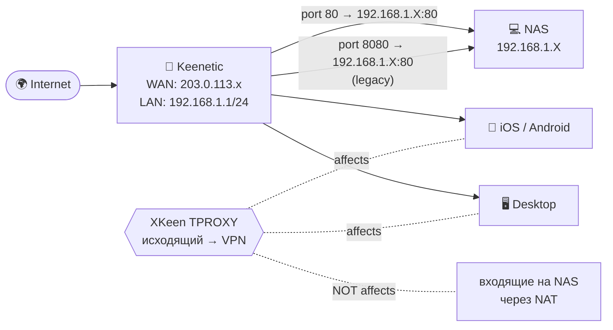

**Важно про XKeen:**
- TPROXY перехватывает **исходящий** трафик из LAN, идущий в интернет (для bypass-блокировок).
- **Входящие** соединения (CF → Router → NAS) идут через PREROUTING NAT **до** TPROXY-цепочек — XKeen их не трогает.
- inadyn запущен **на самом роутере** и читает IP с интерфейса eth3 локально, не делая внешних запросов → тоже минует XKeen.

### 2.2. NAS (Synology DSM 7.3.2)

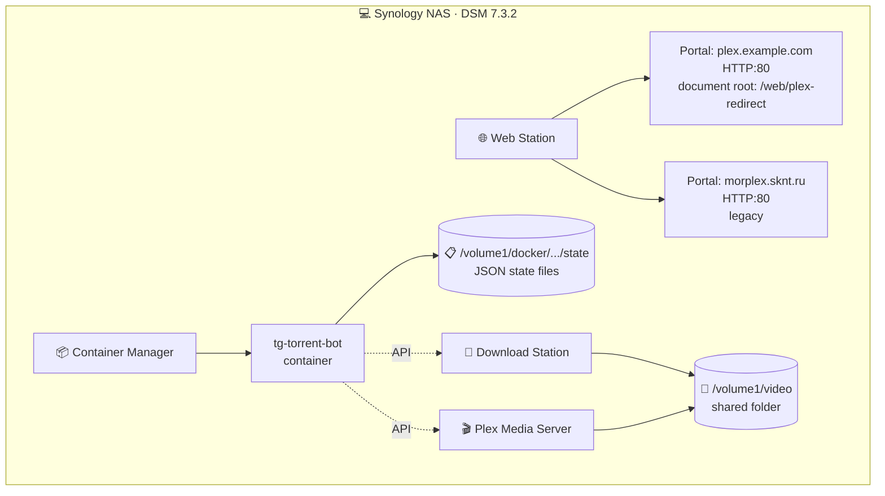

| Сервис | Роль | Связь с ботом |
|---|---|---|
| **Container Manager** | Запускает Docker-контейнер `tg-torrent-bot` | Host: env-переменные, mount state-папки |
| **Web Station** | Отдаёт статический `plex.html` для redirect Plex deeplink | Используется как hosted page для CF-proxied URL |
| **Download Station** | Принимает .torrent / magnet через API, выполняет загрузку | Bot вызывает `create_torrent_file` / `create_magnet`, polls `list_tasks` |
| **Plex Media Server** | Индексирует библиотеку, отдаёт metadata | Bot вызывает PlexAPI для pre-check, polling после скачивания |
| **File Station** | Общая `/volume1/video` для DS и Plex | DS пишет туда, Plex читает оттуда |

### 2.3. Роутер (Keenetic + entware + XKeen + inadyn)

| Компонент | Назначение |
|---|---|
| **Keenetic OS** | Базовая прошивка, NAT, firewall, WAN PPPoE |
| **OPKG/entware** | Пакетный менеджер OpenWRT-style (`/opt/`) |
| **XKeen** | Xray-клиент для bypass-блокировок (исходящий трафик из LAN) |
| **inadyn** | DDNS-клиент: читает IP с `eth3`, обновляет Cloudflare DNS каждые 5 мин |
| **Port forwarding** | `80 → NAS:80` (для CF Proxied), `8080 → NAS:80` (legacy) |

### 2.4. Внешние сервисы

| Сервис | Назначение | Доступ |
|---|---|---|
| **Telegram Bot API** | Long-polling + sendMessage | HTTPS / Bot Token |
| **Cloudflare** | DNS zone `example.com`, Proxied (HTTPS+TLS+anti-DDoS) | API Token (Zone:DNS:Edit) |
| **Jackett** | Единая точка для трекеров (RT, NNM, BFG, RuTor…) | HTTP / API Key |
| **Rutracker.org** | Прямой клиент `rutracker_client` как fallback для Jackett-proxy 404 | Login/password сессия |
| **Kinopoisk API** | Обогащение `/new` (рейтинг, постер, год, жанры) | kinopoiskapiunofficial.tech / API Key |

---

## 3. Модули бота

```mermaid
graph TD
    bot[bot.py<br/>~7000 строк, Telegram handlers + точка входа]

    bot --> dl[download_station.py<br/>DS API client]
    bot --> rt[rutracker.py<br/>RT login + search + download]
    bot --> jk[jackett.py<br/>Jackett search + download]
    bot --> plex[plex.py<br/>PlexClient · movies + shows + library cache]
    bot --> kp[kinopoisk.py<br/>KP API · search + cache]
    bot --> ss[state_store.py<br/>JSON persistence]
    bot --> md[movie_discovery.py<br/>/new ranking · _compute_card_score]
    bot --> tp[task_policies.py<br/>notification rules · recipients]
    bot --> tv[task_views.py<br/>card formatting]
    bot --> kb[keyboards.py<br/>InlineKeyboard builders]
    bot --> fmt[formatters.py<br/>regex helpers · series · quality]
    bot --> ac[access_control.py<br/>allowed/admin chat_ids]
    bot --> ts[tracker_service.py<br/>публичные трекеры для BT]
    bot --> jsubs[jackett_subscriptions.py<br/>RT/Jackett подписки на новые серии]
    bot --> diag[diagnostics.py<br/>проверка всех сервисов для /admin]
```

**Структурно:**
- **Handlers** (внутри `bot.py`) — все Telegram update-callback'и (`movie_new_command`, `search_download`, `admin_callback`, …).
- **Clients** — отдельные файлы для каждого внешнего сервиса.
- **State** — `state_store.py` — единственная точка работы с JSON-файлами.
- **Domain logic** — `movie_discovery.py` (рейтинг), `task_policies.py` (правила уведомлений), `formatters.py` (парсинг сериалов / качества).

---

## 4. Хранилище состояния (JSON files)

Все файлы в `/volume1/docker/tg-torrent-bot/state/` (mounted в контейнер).

| Файл | Назначение |
|---|---|
| `approved_chat_ids.json` | Список одобренных пользователей (`{chat_id: {name, added_at}}`) |
| `task_owners.json` | `task_id → chat_id` владельца задачи |
| `task_meta.json` | Per-task: `kind`, `title`, `year`, `quality`, `series_query`, `season_num` |
| `notified_tasks.json` | Per-task: `status_key`, `sent[]`, `failures{chat: N}`, `subscribers[]`, `plex_done` |
| `auto_delete_tasks.json` | `task_id → timestamp` для авто-очистки |
| `tracker_processed.json` | Set задач куда уже добавлены публичные трекеры |
| `topic_subscriptions.json` | RT/Jackett подписки на новые серии сериалов |
| `movie_discovery_cache.json` | Top-N фильмов `/new` с score, кэш KP, fingerprints |
| `movie_discovery_settings.json` | `jackett_trackers_enabled`, `movie_seen_by_user` (per-user 🆕 плашка), `subs` |
| `pending_downloads.json` | Отложенные загрузки с retry-state и TTL |

**Persistence guarantee:**
- Atomic write (через `os.replace` от tmp-файла).
- В критических местах (notifications) — `_save_notified_tasks` после каждой задачи, не в конце цикла.
- Auto-prune: `_run_prune_stale_state_once` чистит записи для удалённых из DS задач.

---

## 5. Фоновые циклы

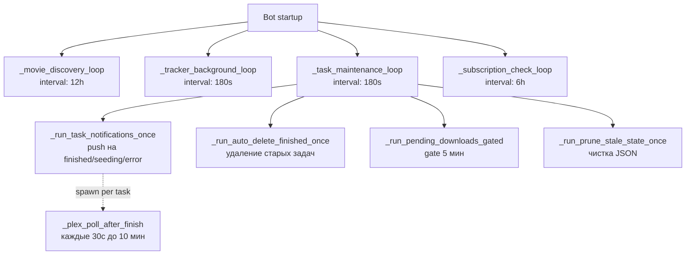

| Loop | Интервал | Что делает |
|---|---|---|
| `_movie_discovery_loop` | 12h | Refresh top-N фильмов из Jackett + KP enrichment; per-user push новинок |
| `_tracker_background_loop` | 180s | Добавление публичных трекеров к BT-задачам |
| `_task_maintenance_loop` | 180s | Объединяет 4 подзадачи (см. ниже) |
| → `_run_task_notifications_once` | каждый tick | Push при finished/seeding/error; classify transient/permanent |
| → `_run_auto_delete_finished_once` | каждый tick | Удаление DS-задач старше TTL |
| → `_run_pending_downloads_gated` | gate 5 мин | Retry отложенных скачиваний |
| → `_run_prune_stale_state_once` | каждый tick | Чистка записей для удалённых из DS задач |
| `_plex_poll_after_finish` | spawned per task, 30s × 20 | Поиск файла в Plex после finished; push «✅ добавлен в Plex» |
| `_subscription_check_loop` | 6h | Проверка RT/Jackett подписок на новые серии |

---

## 6. Пользовательские флоу

### 6.1. Поиск и скачивание

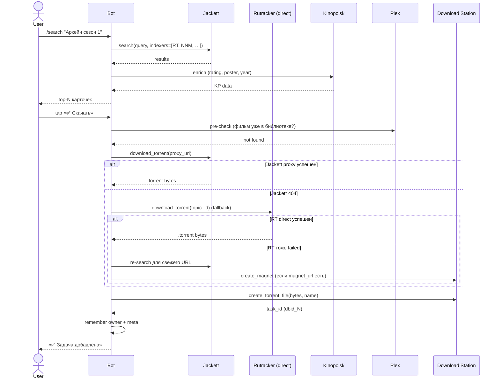

### 6.2. Финальное уведомление + Plex polling

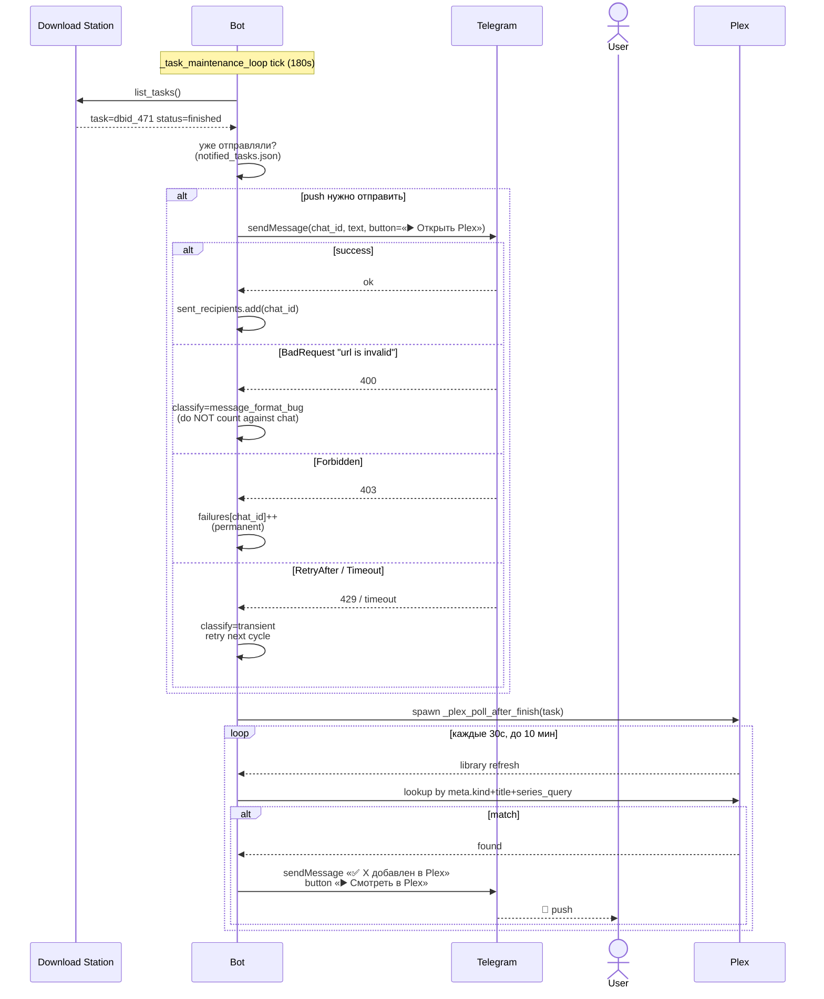

### 6.3. Открытие фильма в Plex (deeplink)

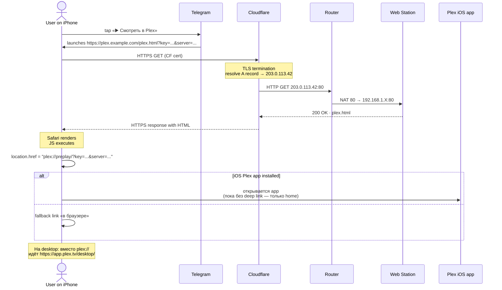

### 6.4. Смена WAN IP провайдером

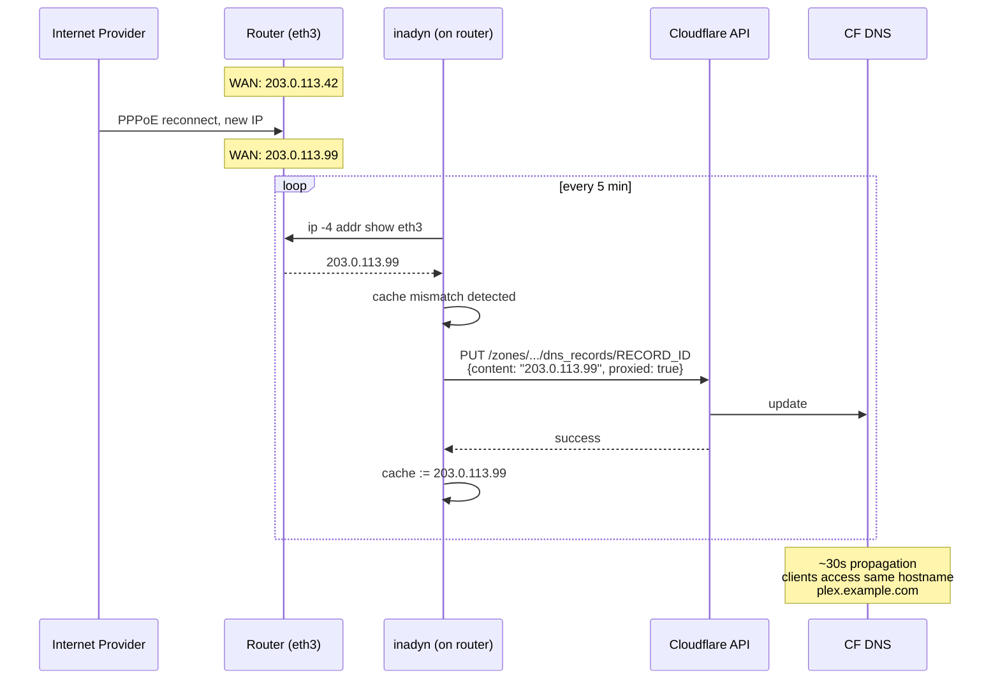

### 6.5. Pending download queue

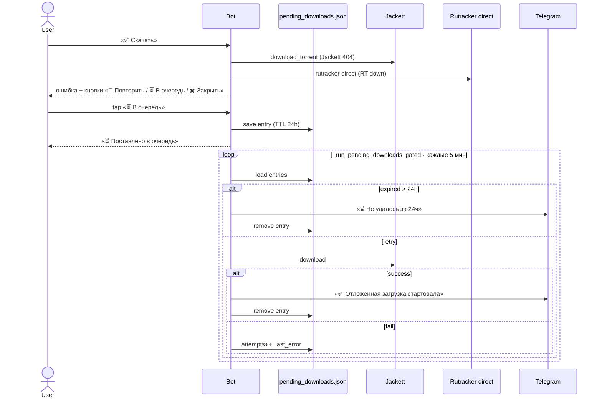

### 6.6. /new push о новинках

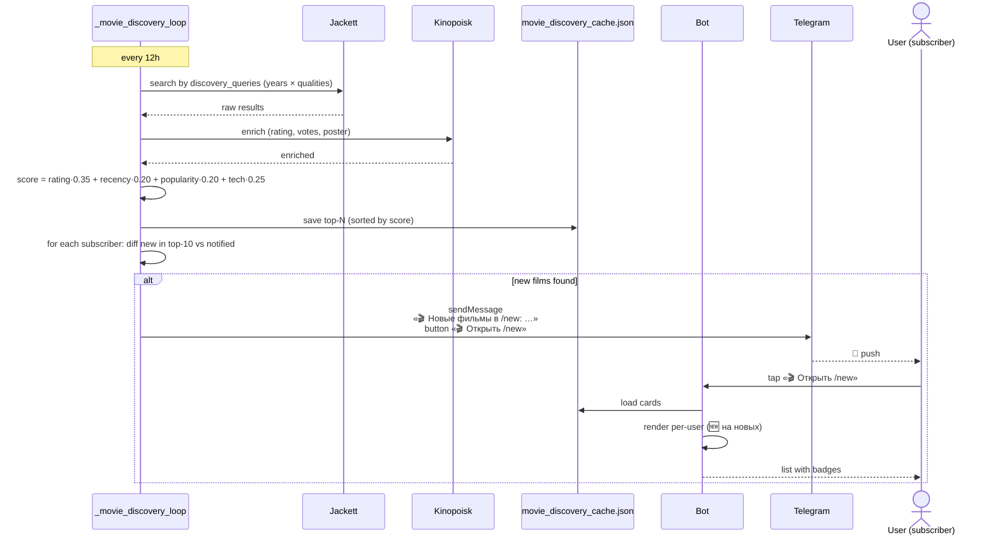

### 6.7. Admin: сброс failure-счётчиков

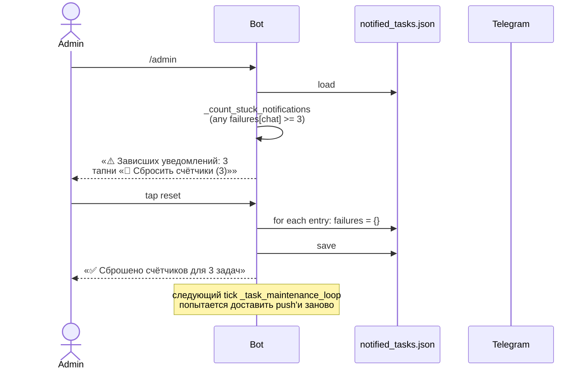

---

## 7. Cloudflare Proxied + DDNS — детально

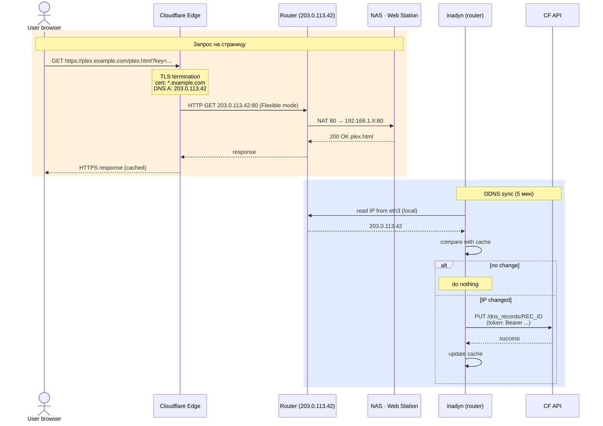

**Ключевые моменты:**

| Уровень | Что делает |
|---|---|
| **TLS** | Сертификат `*.example.com` выдан Cloudflare автоматически (Universal SSL). Клиент видит HTTPS зелёный замок. |
| **Origin protocol** | SSL/TLS mode `Flexible` — CF идёт к origin по HTTP. Не нужен LE на NAS. |
| **WAN IP скрытие** | Клиент видит только CF IP, не наш реальный. Защита от direct attack. |
| **Anti-DDoS** | Бесплатный basic от CF, фильтрует bot traffic. |
| **DDNS** | inadyn на роутере читает локально WAN IP (минуя XKeen), обновляет CF DNS API. Сервис устойчив к смене IP провайдером. |

---

## 8. Технологический стек

| Слой | Технологии |
|---|---|
| **Bot runtime** | Python 3.14, `python-telegram-bot` 22.x, `asyncio`, `httpx` |
| **Bot deployment** | Docker (Synology Container Manager), Alpine base |
| **State** | Plain JSON-файлы с atomic write (через tmp + `os.replace`) |
| **Tests** | `pytest` 9.x, `unittest.mock`, 645+ тестов |
| **External APIs** | Telegram Bot API, Cloudflare API, Plex Media Server API, Kinopoisk API, Jackett (Torznab) |
| **NAS OS** | DSM 7.3.2 (Synology) |
| **Router** | Keenetic (OPKG/entware), XKeen (Xray), inadyn 2.12 |
| **DNS / CDN** | Cloudflare (free plan, Proxied) |
| **Doc** | Markdown + Mermaid (рендерится GitHub UI), PowerPoint (.pptx) |

---

## 9. Что построили: timeline

Хронологический порядок ключевых коммитов (новейший снизу — последовательность фикса/добавления фич):

| Commit | Что |
|---|---|
| `3fe6ea1` | fix(/new): resort cards on cache hit; rename Plex unmatched button |
| `d8339cf` | feat(search): support SxxExx series format in season filters |
| `240649f` | ui: shorten Plex unmatched notify toggle to fit on mobile |
| `7a5c17f` | feat(search): offer relaxed filter retries on 'no results' dead-ends |
| `98dd02d` | fix(notifications): retry transient errors without penalty; persist state per-task |
| `0497780` | feat(download): auto-fallback to rutracker_client on Jackett proxy failure |
| `a4c3096` | feat(download): compact error message with retry button on download failure |
| `141be72` | feat(download): pending download queue with auto-retry and TTL drop |
| `c1a4bc9` | fix(notifications): log skip reasons and recover recipients from task-card registry |
| `a015880` | fix(notifications): replace plex:// URL; protect classifier from format bugs; admin reset |
| `6c2f15d` | docs: rebrand to CineDownload and reorganise feature list by user-facing priority |
| `1e71e04` | feat(plex): configurable deep-link redirect for native iOS app; close buttons |
| `d3fec88` | fix(plex): fall back to title-only lookup when series year mismatches premiere year |
| **+ infra** | Web Station portal + Cloudflare Proxied + inadyn DDNS на роутере |

**Уроки:**
1. Telegram изменил политику URL-схем в inline-кнопках (отказались от `plex://`) — нужны https-redirect страницы.
2. Plex iOS app в последних версиях игнорирует deeplink-параметры — Plex Web остаётся единственным working путём для «открыть фильм X».
3. NAT-based home setup требует defensive DDNS (даже если у вас «белый» IP — провайдер может его сменить без предупреждения).
4. Per-chat failure counters в notification-логике должны различать **наш баг** (формат сообщения) и **реальные проблемы** chat — иначе один сломанный URL парализует доставку всех push для всех пользователей навсегда.

---

## Что дальше смотреть

- **README.md** — пользовательская инструкция (команды, env-переменные, setup).
- **CLAUDE.md** — правила проекта + карта диагностических логов (искать в логах эти маркеры при сбоях).
- **`.env.example`** — все настраиваемые env-переменные с дефолтами.
- **`compose.yaml`** — Docker-compose для Synology Container Manager.
