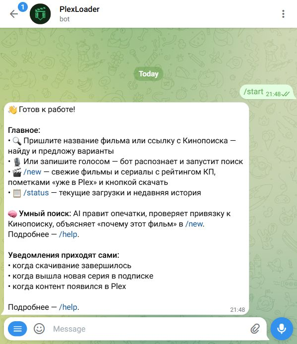
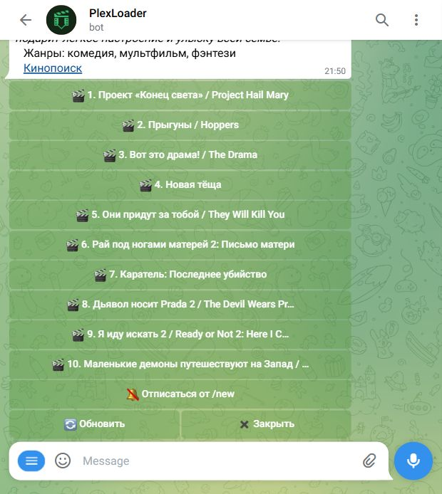
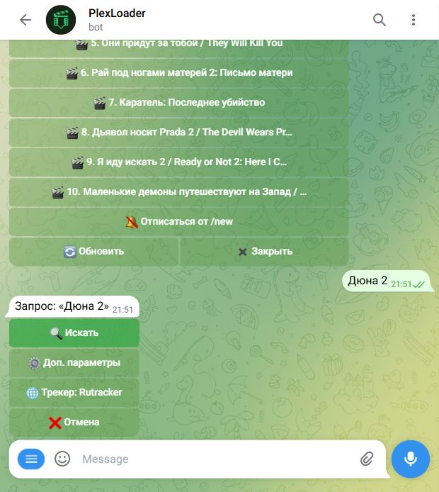
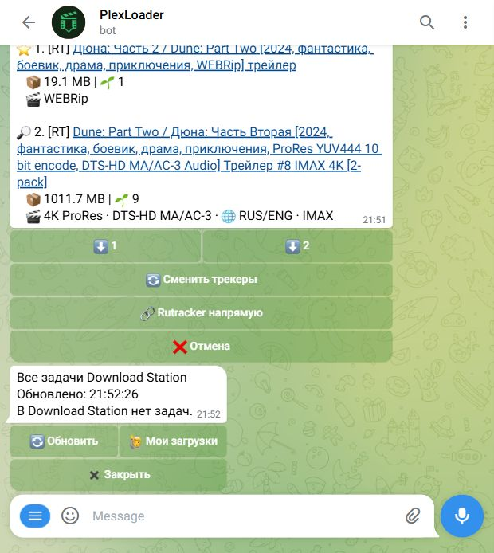
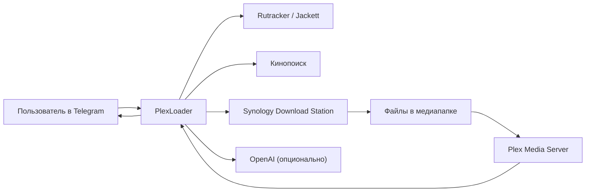
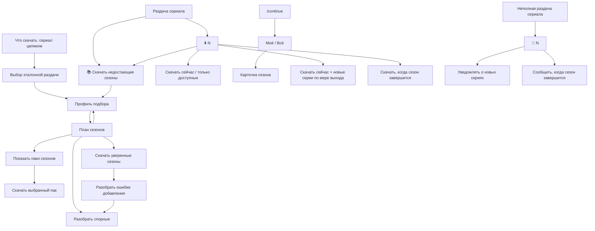
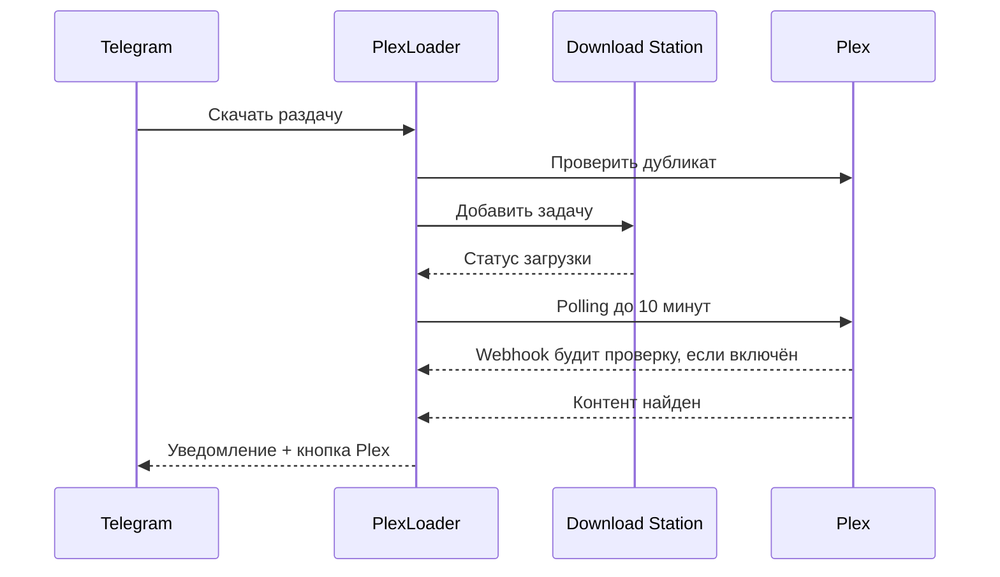

# PlexLoader

[](https://github.com/KiMorev/tg-torrent-bot/actions/workflows/test.yml)
[](https://github.com/KiMorev/tg-torrent-bot/pkgs/container/tg-torrent-bot)

PlexLoader — Telegram-бот для домашнего медиасервера на Synology + Plex.

Он ищет фильмы и сериалы на Rutracker и через Jackett, добавляет `.torrent` и `magnet:` в Synology Download Station, показывает прогресс, следит за новыми сериями, проверяет дубли в Plex и присылает кнопку просмотра, когда контент появился в библиотеке.

Если подключить Кинопоиск и OpenAI, бот становится заметно умнее: показывает подборку свежих фильмов `/new`, помечает уже добавленное в Plex, исправляет опечатки, распознаёт голосовые запросы, объясняет пустую выдачу и даёт короткие пояснения к карточкам.

## Скриншоты

Реальные кадры из Telegram Web, снятые с работающего PlexLoader:

<table>
  <tr>
    <td width="50%"></td>
    <td width="50%"></td>
  </tr>
  <tr>
    <td><b>Старт</b><br>Главные сценарии и подсказки пользователю.</td>
    <td><b>/new</b><br>Свежие фильмы, подписка, обновление и быстрый переход к раздачам.</td>
  </tr>
  <tr>
    <td width="50%"></td>
    <td width="50%"></td>
  </tr>
  <tr>
    <td><b>Поиск</b><br>Быстрый запуск, доп. параметры и выбор трекера.</td>
    <td><b>/status</b><br>Панель загрузок Download Station без перехода в DSM.</td>
  </tr>
</table>

## Зачем это нужно

Обычный путь без PlexLoader выглядит так: открыть трекер, найти подходящую раздачу, скачать torrent, зайти в Download Station, добавить задачу, дождаться загрузки, проверить Plex, обновить библиотеку, найти фильм.

С PlexLoader путь короче:

1. Написать боту название фильма, сериала, ссылку Кинопоиска или голосовое.
2. Выбрать раздачу в Telegram.
3. Получить уведомление о завершении и кнопку открытия в Plex.



## Возможности

### Поиск и скачивание

- Поиск по обычному тексту: `Дюна 2`, `Во все тяжкие 3 сезон`, `Fallout 1080p`, `Клиника все сезоны LostFilm`.
- Поиск по ссылке Кинопоиска: бот извлекает название, год и тип контента, а параметры вроде `4к`, `с субтитрами`, `все сезоны` можно написать рядом со ссылкой.
- Голосовой поиск через OpenAI Whisper, если задан `OPENAI_API_KEY`; распознанный текст проходит тот же разбор намерения, что и обычный запрос.
- Поиск учитывает личные предпочтения из `/settings`: качество, Original, субтитры и предпочитаемые переводы.
- Настройка `Что скачать`: `одна раздача` для обычного поиска или `сериал целиком` для выбора эталонной раздачи и сборки плана по сезонам.
- Дополнительные параметры: `4K`, `1080p`, `720p`, любое качество, оригинальная дорожка, субтитры.
- Выбор трекеров Jackett прямо из Telegram.
- Если в запросе явно указана озвучка, бот ищет её среди найденных релизов; если такой озвучки нет, показывает альтернативы с понятным предупреждением.
- Прямой Rutracker-поиск и fallback на него, если Jackett не смог скачать раздачу.
- Если поиск ничего не нашёл или источник временно упал, бот показывает применённые ограничения и предлагает следующий шаг: повторить поиск, снять качество, расширить трекеры или закрыть экран. При включённом GPT на настоящей пустой выдаче появляется короткая подсказка о вероятной причине.
- Если раздача найдена, но загрузку не удалось добавить, бот объясняет причину и предлагает повторить сейчас или поставить скачивание в очередь.
- Загрузка отправленных в чат `.torrent`-файлов и `magnet:`-ссылок.

### Предпочтения поиска

Команда `/settings` открывает личные предпочтения поиска. Бот учитывает их как пожелания к новым поискам; если точного варианта нет, он покажет альтернативы с пояснением:

- качество: `4K`, `1080p`, `720p` или любое;
- Original;
- субтитры;
- предпочитаемые переводы, например `LostFilm` или `NewStudio`.

Предпочтения из `/settings` — мягкий приоритет: подходящие релизы поднимаются выше, а если точного варианта нет, бот показывает другие варианты с пояснением. Это относится к Original, субтитрам и переводам. В bulk-подборе перевод из `/settings` или запроса тоже работает как мягкий бонус к подбору сезонов; строгим ограничением озвучка становится только после ручного выбора в профиле.

### Сериалы и подписки

Если нужно скачать сериал целиком, не нужна отдельная команда: в настройках поиска выберите `🎚 Что скачать: сериал целиком`. Бот найдёт только сериальные раздачи, предложит выбрать эталон, а затем откроет профиль bulk-подбора. Озвучка выбирается после эталона, когда бот уже видит реальные дорожки выбранного релиза. Если в запросе явно указан сезон, бот мягко подскажет, что можно искать одну раздачу или собрать план по всем сезонам.

Для сериальных раздач `⬇️ N` открывает выбор действий:

- `⬇️ Скачать сейчас`
- `📚 Скачать недостающие сезоны` — выбрать профиль подбора, собрать план по сезонам, Plex и текущим загрузкам; бот сам добирает кандидатов широким и точечным поиском, предлагает скачать уверенные сезоны после подтверждения, а спорные и неполные сезоны выносит в ручной разбор

Для неполных сезонов в этом же меню появляются дополнительные варианты:

- `⬇️ Скачать сейчас + новые серии по мере выхода`
- `⬇️ Скачать только доступные`
- `📦 Скачать, когда сезон завершится`

Перед сборкой bulk-плана бот показывает короткий профиль подбора: качество, Original, субтитры и текущую политику озвучки. По умолчанию используется `любая из эталона`; предпочитаемый перевод только поднимает подходящие сезоны выше и не блокирует другие найденные варианты. Озвучку можно раскрыть прямо на этом экране и выбрать `одна на все сезоны` или ручной выбор одной-двух студий, а качество/Original/субтитры спрятаны в `⚙️ Остальные настройки`. Сборку можно отменить во время поиска: бот остановится после текущего сетевого шага и не сохранит план. Если сборка затянулась, бот обновит тот же экран мягким статусом и оставит кнопку отмены. Если широкий поиск Jackett упёрся в лимит, бот доберёт все нужные сезоны точечными запросами; предупреждение останется только если точечный добор тоже не снял риск неполной выдачи. Если после проверки скачивать или разбирать нечего, бот покажет финальный экран и не сохранит план. Если временно не удалось добавить уверенный сезон в Download Station, бот поставит его в очередь на фоновый повтор и обновит план после успеха. После `⬇️ Скачать уверенные` бот не теряет спорные сезоны: показывает сколько осталось разобрать и оставляет кнопки `⚙️ Разобрать оставшиеся` / `⬅️ К плану`. Если в выдаче есть паки сезонов, бот показывает кнопку `📦 Показать паки сезонов`; пак можно скачать только вручную после отдельного подтверждения, и тогда сезоны из диапазона пака в этом плане помечаются как скачанные паком. Если после просмотра плана настройки нужно поменять, кнопка `🔄 Пересобрать план` возвращает к профилю и запускает новую сборку; прежний сохранённый план скрывается как пересобранный. В bulk-плане кнопка `⚙️ Разобрать спорные` появляется, если сезон нельзя выбрать автоматически, сезон не найден или постоянная ошибка добавления требует ручного решения. Для спорных кандидатов GPT может добавить короткую подсказку, но скачивание всё равно остаётся ручным выбором. Для спорного или ненайденного сезона можно нажать `🔄 Искать мягче`: бот точечно ищет этот сезон без жёстких требований к качеству, Original, субтитрам и озвучке, но всё равно просит выбрать раздачу вручную. Для ошибки добавления можно повторить тот же вариант, выбрать другую найденную раздачу или пропустить сезон. Для неполного сезона можно скачать доступные серии, скачать доступные и следить за новыми, ждать полного сезона или получать только уведомления.

Команда `/continue` помогает вернуться к неполному сезону, который уже есть в Plex. Бот собирает быстрый список из Plex и истории загрузок, показывает режимы `🙋 Моё` / `🌐 Всё`, листает кандидатов по 10 штук и открывает карточку сезона: сколько серий есть в Plex, какая прошлая тема известна, какой профиль скачивания был сохранён и есть ли точная подписка на эту Rutracker-тему. Ненужный сезон можно скрыть лично для себя; если есть скрытые сезоны, список показывает счётчик и кнопку `🙈 Показать скрытые`, а в скрытом списке сезон можно вернуть. Если сохранённая тема Rutracker обновилась, бот скачает обновлённый torrent из той же темы; для всё ещё неполного сезона сразу сохранит подписку на следующие серии. Если прошлой темы нет или в той же теме новых серий нет, можно поискать похожие раздачи; другой `topic_id` бот называет обновлённой раздачей, а не докачкой.

`🔔 N` остаётся отдельной кнопкой для действий только с уведомлениями:

- `🔔 Уведомлять о новых сериях`
- `🎯 Сообщить, когда сезон завершится`

Подписка хранит две независимые политики: когда уведомлять и когда скачивать. Поэтому бот может, например, молча ждать финала сезона и скачать его одним торрентом, либо уведомлять о каждой новой серии без автозагрузки. В `/subs` можно посмотреть текущий прогресс, статус и изменить эти правила для уже созданной подписки.

После добавления сериальной раздачи появляется кнопка `🔎 Другой сезон`. Если Кинопоиск знает количество сезонов, бот показывает кнопки сезонов; если нет — предлагает ручной ввод.



### Новинки `/new`

`/new` показывает топ свежих фильмов и мультфильмов из трекеров:

- берёт текущий и прошлый год;
- фильтрует CAM/TS, сериалы, adult-раздачи, сборники, трейлеры и спортивные трансляции;
- учитывает качество, размер, сиды, свежесть, страну и рейтинг Кинопоиска;
- показывает топ-10 карточек;
- показывает и пушит только карточки, подтверждённые прошлым top-10, чтобы случайный transient refresh не попадал пользователю;
- добавляет метку `🆕` для фильмов, которые конкретный пользователь ещё не открывал в `/new`; после успешного скачивания из уведомления метка для этого пользователя исчезает;
- добавляет `✅ 1080` / `✅ 2160`, если фильм уже есть в Plex;
- умеет присылать push о новых подходящих фильмах подписчикам `/new`: до трёх KP-обогащённых карточек, которых ещё нет в Plex, ссылка на Кинопоиск в названии при наличии URL, постер главной новинки при наличии постера и обычный текстовый fallback при ошибке;
- в push можно сразу скачать один фильм или все доступные фильмы из уведомления; выбор раздачи мягко учитывает пользовательские настройки качества, Original, субтитров и озвучки, а GPT используется только как tie-break для близких по score вариантов.

Кнопки `/new`:

- карточки `🎬 1...10` — открыть найденные раздачи по фильму;
- `⬇️ 1...3` в push — поставить скачивание выбранной новинки из snapshot уведомления;
- `⬇️ Скачать все N` в push — подтвердить массовую постановку доступных новинок из уведомления;
- `🎬 Открыть /new` в push — открыть список новинок отдельным сообщением и удалить исходное push-уведомление;
- `🔔 Подписаться на /new` / `🔕 Отписаться от /new`;
- `🔄 Обновить`;
- `✖️ Закрыть`.

Если при обновлении `/new` один из источников временно упал, бот не заменяет хороший кэш подозрительно коротким списком и не отправляет push по деградированному refresh.

### Plex

Plex-интеграция опциональна, но именно она делает PlexLoader цельным:

- перед скачиванием бот предупреждает, если фильм или сезон уже есть в Plex;
- в результатах поиска и на экране выбора сезона может заранее подсказать, что фильм/сезон уже есть в Plex, есть в лучшем качестве или может быть улучшен;
- для уже существующего контента показывает качество и предлагает скачать всё равно или заменить версией лучше;
- после завершения загрузки проверяет имена файлов сериала; если эпизоды явно не в Plex-формате, предлагает план переименования и не запускает ожидание Plex до решения пользователя;
- после завершения загрузки до 10 минут ждёт появления фильма или сезона в Plex;
- опционально принимает Plex webhook в LAN и будит эту проверку сразу после события Plex;
- присылает уведомление `✅ ... добавлен в Plex`;
- добавляет кнопку `▶️ Смотреть в Plex`, когда Plex нашёл конкретный фильм или сезон;
- если Plex не подтвердил появление за время ожидания, предлагает открыть задачу и проверить статус загрузки;
- в `/admin` показывает радар файлов без матча metadata;
- может присылать администратору push, когда в Plex появился новый несматченный файл.
- в радаре и push по несматченным файлам имя файла ведёт в Plex Web на карточку metadata, если Plex уже отдал `ratingKey`.



### Администрирование

`/admin` — компактная панель состояния:

- Download Station: всего задач, активные, завершённые, ошибки;
- если Download Station не отвечает быстро, `/admin` остаётся доступным и показывает timeout вместо долгого ожидания;
- подписки на серии и `/new`;
- зависшие уведомления и кнопка сброса счётчиков;
- состояние интеграций: Rutracker, Jackett, Кинопоиск, Plex, публичные трекеры;
- диагностика внешних сервисов;
- управление пользователями;
- выбор Jackett-трекеров для рейтинга `/new`;
- управление KP-кэшем;
- радар Plex-файлов без матча;
- блок `📀 Хранилище` и переименование файлов сериалов для Plex, если в контейнер проброшен `/storage`.

`/status` показывает загрузки Download Station. Для администратора есть переключатель `🙋 Мои загрузки` / `🌐 Все загрузки`; в общем списке рядом с задачей виден владелец, включая имя пользователя, если оно известно боту. Обычный пользователь видит только свои задачи. Сверху есть короткая сводка по активным, завершённым и проблемным задачам; завершённые и `seeding`-задачи показываются компактно с датой, временем, объёмом и сроком автоочистки, если автоочистка включена для этого статуса. Если Download Station пометил BT-задачу ошибкой уже после 100% скачивания и не отдал конкретный `error_detail` или вернул `unknown`, PlexLoader считает это мягким завершением: показывает статус `Скачано полностью`, объясняет, что DS показал ошибку, но файл скачан полностью, и продолжает проверку Plex.

## Быстрый старт на Synology

MVP-установщик уже есть. Он настраивает базовое ядро: Telegram-бот + Synology Download Station. Rutracker, Jackett, Plex, `/new` и OpenAI пока подключаются после установки через `.env`; следующие итерации мастера будут добавлять их по одному.

### Что понадобится

- Synology с установленным `Container Manager` / Docker.
- SSH-доступ к NAS пользователем, который может запускать Docker.
- Новый Telegram-бот из [@BotFather](https://t.me/BotFather): понадобится только `BOT_TOKEN`.
- DSM-пользователь для PlexLoader, например `tg_bot_ds`, с доступом к Download Station и папке загрузки.

### Установка одной командой

Подключитесь к NAS по SSH и выполните:

```bash
curl -fsSL https://raw.githubusercontent.com/KiMorev/tg-torrent-bot/main/install.sh | sh
```

Если `curl` не установлен, можно так:

```bash
wget -qO- https://raw.githubusercontent.com/KiMorev/tg-torrent-bot/main/install.sh | sh
```

Установщик:

- проверит Docker и `docker compose` / `docker-compose`;
- создаст папку `/volume1/docker/plexloader`;
- скачает [`compose.yaml`](compose.yaml) и мастер [`scripts/setup_wizard.py`](scripts/setup_wizard.py);
- отключит необязательный `/storage` mount, если на NAS нет `/volume1/video`;
- проведёт по настройке Telegram и Download Station;
- создаст `.env`;
- запустит контейнер;
- проверит, что `tg_torrent_drop` реально поднялся, а при ошибке покажет последние логи.

### Что спросит мастер

1. `BOT_TOKEN`: откройте [@BotFather](https://t.me/BotFather), создайте бота командой `/newbot` и скопируйте token.
2. Telegram `chat_id`: мастер попросит написать `/start` вашему боту и сам попробует прочитать `chat_id` через Telegram `getUpdates`. Ручной ввод нужен только если Telegram не отдаст update.
3. DSM URL: по умолчанию `https://host.docker.internal:5001`. Это адрес DSM из контейнера; установщик умеет проверить его с NAS через локальный fallback.
4. DSM account / password: пользователь Synology с доступом к Download Station.
5. Папка назначения Download Station: обычно `video` или другая папка, настроенная в Download Station.

Если DSM использует самоподписанный сертификат, мастер сам попробует fallback `DS_VERIFY_SSL=false`. Если Download Station не проходит проверку, установщик покажет причину и предложит ввести данные заново.

### Ручной fallback

Если автоматическая установка не подходит, можно развернуть вручную:

1. Создайте папку `/volume1/docker/plexloader`.
2. Скачайте туда [`compose.yaml`](compose.yaml).
3. Создайте `.env` по примеру [`.env.example`](.env.example).
4. В Synology Container Manager создайте проект из этой папки и запустите его.

Минимальный `.env` для ручного запуска:

```env
BOT_TOKEN=123456:replace_me
ALLOWED_CHAT_IDS=123456789
ADMIN_CHAT_IDS=123456789
STATE_DIR=/data

DS_URL=https://host.docker.internal:5001
DS_ACCOUNT=tg_bot_ds
DS_PASSWORD=replace_me
DS_DESTINATION=video
DS_VERIFY_SSL=false
```

### Проверить запуск

В Telegram:

- `/ping` должен ответить `pong`;
- `/status` должен показать задачи Download Station;
- `/admin` должен открыть панель администратора;
- `/help` покажет доступные возможности с учётом включённых интеграций.

## Настройка интеграций

Полный список переменных лежит в [`.env.example`](.env.example). Ниже — что реально важно настроить осознанно.

### Доступ

| Переменная | Что делает |
|---|---|
| `ALLOWED_CHAT_IDS` | Список chat_id, которым разрешён доступ. Можно несколько через запятую. |
| `ADMIN_CHAT_IDS` | Администраторы. Если пусто, админами считаются все из `ALLOWED_CHAT_IDS`. |
| `ACCESS_APPROVALS_ENABLED` | Если `true`, новые пользователи могут запросить доступ у администратора. |

### Поиск

| Переменная | Что делает |
|---|---|
| `RUTRACKER_USERNAME`, `RUTRACKER_PASSWORD` | Включают прямой поиск и скачивание с Rutracker. Нужно задавать обе. |
| `RUTRACKER_MAX_RESULTS` | Максимум результатов прямого Rutracker-поиска. |
| `JACKETT_URL`, `JACKETT_API_KEY` | Включают поиск через Jackett. Нужно задавать обе. |
| `JACKETT_INDEXERS` | Индексеры Jackett для обычного поиска. По умолчанию `all`. |
| `JACKETT_MAX_RESULTS` | Сколько результатов показывать из Jackett. |
| `JACKETT_FETCH_LIMIT` | Сколько сырых результатов запрашивать у Jackett до фильтрации. |
| `JACKETT_SEARCH_TIMEOUT_SECONDS` | Сколько секунд бот ждёт ответ поиска Jackett. По умолчанию `90`, потому что некоторые индексеры возвращают кэш только после своего 60-секундного timeout. |
| `JACKETT_WARMUP_ENABLED` | Включает лёгкий фоновый прогрев Jackett, если Jackett настроен. |
| `JACKETT_WARMUP_INTERVAL_SECONDS` | Как часто запускать прогрев. По умолчанию 15 минут. |
| `JACKETT_WARMUP_QUERY` | Короткий запрос для прогрева. По умолчанию `1080p`. |
| `JACKETT_WARMUP_INDEXERS` | `auto` берёт `JACKETT_INDEXERS`, а при `all` ротирует все настроенные индексеры пачками. Можно задать список через запятую. |
| `JACKETT_WARMUP_BATCH_SIZE` | Сколько индексеров греть за один цикл. По умолчанию `3`. |
| `KINOPOISK_API_KEY` | Включает поиск по ссылкам Кинопоиска и обогащение `/new`. |
| `TMDB_API_TOKEN` | Включает точное определение количества серий в сезоне для `/continue` по Plex external ids. TVmaze без ключа дополнительно проверяет `imdb`/`tvdb` совпадения и отсекает конфликтующие totals. Нужен верхний TMDB `API Read Access Token`. |

Для комфортной работы достаточно включить Rutracker или Jackett. Лучше включить оба: Jackett даёт широкий поиск, прямой Rutracker используется как fallback. Если Jackett включён, бот периодически делает короткий фоновый запрос к небольшой пачке индексеров, чтобы первый пользовательский поиск после простоя реже попадал в холодный старт.

### Plex

| Переменная | Что делает |
|---|---|
| `PLEX_URL` | URL Plex Media Server, например `http://192.168.1.103:32400`. |
| `PLEX_TOKEN` | Token Plex. |
| `PLEX_MOVIE_SECTION` | ID movie-секции. Можно оставить пустым: бот найдёт первую movie-секцию сам. |
| `PLEX_DEEPLINK_BASE_URL` | HTTPS-страница-редирект для открытия Plex-приложения с iOS/Android. Если пусто, кнопки ведут в Plex Web. |
| `PLEX_WEBHOOK_ENABLED` | Включает LAN endpoint для Plex webhook. Webhook не заменяет polling, а будит текущую проверку появления файла в Plex. |
| `PLEX_WEBHOOK_PORT` | Порт webhook endpoint. По умолчанию `8099`; compose публикует этот порт на хост. |
| `PLEX_WEBHOOK_TOKEN` | Shared token для `POST /plex/webhook` и `GET /plex/webhook/health`. Не публикуйте endpoint наружу без отдельной защиты. |
| `PLEX_WEBHOOK_DEBOUNCE_SECONDS` | Минимальный интервал между принятыми webhook-триггерами. По умолчанию `10`. |

Для будущего установщика лучший путь — официальный Plex auth flow: пользователь открывает ссылку Plex, подтверждает доступ, а установщик получает token сам. Ручной fallback: в Plex Web откройте карточку любого фильма, выберите `Get Info` → `View XML` и возьмите параметр `X-Plex-Token` из открывшегося URL. Если пункт меню отличается в вашей версии Plex Web, можно открыть DevTools → Network и найти `X-Plex-Token` в запросах к Plex.

Чтобы включить Plex webhook, задайте `PLEX_WEBHOOK_ENABLED=true`, сгенерируйте длинный `PLEX_WEBHOOK_TOKEN` и добавьте в Plex Web → Settings → Webhooks URL:

```text
http://<NAS_IP>:8099/plex/webhook?token=<PLEX_WEBHOOK_TOKEN>
```

Проверка доступности endpoint:

```text
http://<NAS_IP>:8099/plex/webhook/health?token=<PLEX_WEBHOOK_TOKEN>
```

После изменения `.env` или `compose.yaml` примените конфигурацию командой `docker compose up -d`. Если запускаете локальную сборку из checkout, используйте `docker compose up -d --build`.

Для `/continue` нужен `TMDB_API_TOKEN`: Plex даёт external ids сериала, а TMDB по ним возвращает точное количество эпизодов в конкретном сезоне. Если у Plex есть `imdb`/`tvdb`, бот дополнительно сверяет сезон с TVmaze и скрывает Plex-only кандидат при конфликте нумерации сезонов. Без TMDB бот не считает Plex `leafCount` общим размером сезона и не показывает сезон как уверенно неполный.

### `/new`

| Переменная | Что делает |
|---|---|
| `MOVIE_DISCOVERY_ENABLED` | Включает `/new`. Нужен хотя бы Rutracker или Jackett. |
| `MOVIE_DISCOVERY_INTERVAL_HOURS` | Интервал фонового обновления, по умолчанию 6 ч. |
| `MOVIE_DISCOVERY_RUTRACKER_TM` | Диапазон Rutracker: `1`, `3`, `7`, `14`, `32`, `-1`. |
| `MOVIE_DISCOVERY_JACKETT_REQUIRE_DATE` | Требовать дату публикации от Jackett. |
| `MOVIE_DISCOVERY_JACKETT_MAX_AGE_DAYS` | Максимальный возраст Jackett-раздачи. |
| `MOVIE_DISCOVERY_LIMIT` | Сколько карточек хранить в кэше. В интерфейсе показывается топ-10. |
| `MOVIE_DISCOVERY_MIN_KP_RATING` | Минимальный рейтинг Кинопоиска. |
| `MOVIE_DISCOVERY_QUALITIES` | Качества через запятую, например `1080p` или `1080p,2160p`. |

Трекеры Jackett, которые участвуют именно в рейтинге `/new`, можно переключать без перезапуска: `/admin` → `🎬 Трекеры новинок`.

### Уведомления, очередь и автоочистка

| Переменная | Что делает |
|---|---|
| `TASK_NOTIFICATIONS_ENABLED` | Уведомления о завершении, seeding и ошибках задач. |
| `TASK_NOTIFICATION_STATUSES` | Статусы, по которым отправлять уведомления. |
| `TASK_NOTIFY_EXTERNAL_TASKS` | Уведомлять о задачах, созданных не через бота. Обычно `false`. |
| `NOTIFY_CHAT_IDS` | Дополнительные получатели уведомлений. |
| `AUTO_DELETE_FINISHED_AFTER_HOURS` | Через сколько часов удалять завершённые задачи из Download Station. |
| `AUTO_DELETE_FINISHED_STATUSES` | Какие статусы считать кандидатами на автоудаление. |
| `PENDING_DOWNLOADS_ENABLED` | Очередь отложенных загрузок при временных сбоях трекера. |
| `PENDING_DOWNLOADS_INTERVAL_SECONDS` | Как часто очередь повторяет попытку. |
| `PENDING_DOWNLOADS_TTL_HOURS` | Сколько живёт отложенная заявка. |
| `SUBSCRIPTION_CHECK_INTERVAL_HOURS` | Как часто проверять подписки на серии. |

### Публичные трекеры

| Переменная | Что делает |
|---|---|
| `TRACKERS_MODE` | `auto` включает добавление публичных трекеров к BT-задачам. |
| `TRACKERS_URL` | Источник списка публичных трекеров. |
| `TRACKERS_MAX` | Сколько трекеров добавлять. |
| `TRACKERS_CACHE_TTL_HOURS` | TTL кэша списка трекеров. |
| `TRACKERS_BACKGROUND_ENABLED` | Фоновое обновление кэша. |
| `TRACKERS_BACKGROUND_INTERVAL_SECONDS` | Интервал фонового обновления. |

### OpenAI

| Переменная | Что делает |
|---|---|
| `OPENAI_API_KEY` | Включает голосовой поиск и GPT-улучшения. |
| `VOICE_SEARCH_ENABLED` | Принимать Telegram voice как поисковый запрос. |
| `VOICE_MAX_SECONDS` | Максимальная длина голосового сообщения. |
| `GPT_ENABLED` | Включить GPT-подсказки, проверку KP-матчей и пояснения карточек. |
| `GPT_MODEL` | Модель для GPT-улучшений. По умолчанию `gpt-4o-mini`. |

Голосовой поиск использует Whisper API (`whisper-1`). GPT используется точечно: разбор сложного поискового запроса, did-you-mean и объяснение пустой выдачи, проверка KP-матча, бейджи релизов, пояснения `/new`, подсказки спорных bulk-кандидатов, tie-break близких раздач в push `/new` и метаданные для ручных magnet/`.torrent`. Это pay-per-use, без подписки; лимиты лучше выставить в кабинете OpenAI.

### Хранилище

| Переменная | Что делает |
|---|---|
| `STATE_DIR` | Где хранится JSON-состояние. В Docker по умолчанию `/data`. |
| `STORAGE_ALERT_PERCENT` | Порог предупреждения по заполнению `/storage`. |
| `MAX_TORRENT_FILE_MB` | Максимальный размер загружаемого `.torrent`. |
| `BOT_TIMEZONE`, `TZ` | Часовой пояс отображения и контейнера. |
| `LOG_LEVEL` | Уровень логирования. |

Редко меняемые технические параметры:

| Переменная | Что делает |
|---|---|
| `DS_RETRY_ATTEMPTS`, `DS_RETRY_DELAY` | Повторы API-запросов к Download Station. |
| `MAGNET_POLL_ATTEMPTS`, `MAGNET_POLL_INTERVAL_SECONDS` | Сколько ждать появления task ID после добавления magnet-ссылки. |
| `MOVIE_DISCOVERY_CACHE_FILE` | JSON-кэш карточек `/new`. |
| `MOVIE_DISCOVERY_SETTINGS_FILE` | Runtime-настройки `/new`: выбранные трекеры, подписки на unmatched и т.п. |
| `MOVIE_DISCOVERY_DEBUG_FILE` | Debug-снимок последнего обновления `/new`. |
| `SERIES_BULK_JOBS_FILE` | JSON-файл планов массового скачивания сезонов. |
| `SERIES_CONTINUE_TOTALS_FILE` | JSON-кэш количества эпизодов сезона из TMDB/TVmaze для `/continue`. |
| `SERIES_CONTINUE_HIDDEN_FILE` | JSON-файл персонально скрытых сезонов `/continue`. |

В `compose.yaml` уже есть volume `tg_torrent_drop_state:/data`. Для блока `📀 Хранилище` в `/admin` и переименования сериалов для Plex нужен bind-mount медиапапки:

```yaml
volumes:
  - tg_torrent_drop_state:/data
  - /volume1/video:/storage:rw
```

Если фильмы лежат в другом месте, меняйте только левую часть (`/volume1/video`). Правая часть должна остаться `/storage`; режим `rw` нужен, чтобы бот мог переименовывать исходные файлы после скачивания.

## Команды бота

| Команда | Доступ | Назначение |
|---|---|---|
| `/start` | разрешённые пользователи | Короткое приветствие и главные точки входа. |
| `/help` | разрешённые пользователи | Возможности бота с учётом включённых интеграций. |
| `/ping` | разрешённые пользователи | Проверка связи. |
| `/id` | разрешённые пользователи | Показать текущий `chat_id`. |
| `/status` | разрешённые пользователи | Загрузки Download Station. |
| `/new` | разрешённые пользователи | Подборка свежих фильмов и мультфильмов. |
| `/settings` | разрешённые пользователи | Личные предпочтения поиска: качество, Original, субтитры и предпочитаемые переводы. |
| `/subs` | разрешённые пользователи | Активные подписки пользователя: источник, прогресс, правила уведомлений/скачивания, статус и настройка правил. |
| `/continue` | разрешённые пользователи | Найти в Plex неполные сезоны, открыть карточку сезона и персонально скрыть ненужные кандидаты. |
| `/resume <id>` | разрешённые пользователи | Запустить задачу Download Station по ID. Обычно удобнее через `/status`. |
| `/cancel` | разрешённые пользователи | Отменить активный диалог поиска. |
| `/admin` | администраторы | Панель состояния, диагностики и управления. |
| `/users` | администраторы | Управление доступом пользователей: одобренные, ожидающие заявки, подтверждение удаления доступа. |

После успешного ответа бот удаляет исходное сообщение со slash-командой, чтобы чат не засорялся.

Также можно просто отправить:

- название фильма или сериала;
- ссылку Кинопоиска;
- `.torrent`-файл;
- `magnet:`-ссылку;
- голосовое сообщение, если включён OpenAI.

## Plex-кнопки и iOS

Telegram inline-кнопки должны вести на `https://...`; прямой `plex://...` Telegram отклоняет как неподдерживаемый протокол. Поэтому PlexLoader работает в двух режимах.

### Режим по умолчанию

Если `PLEX_DEEPLINK_BASE_URL` пустой, кнопка `▶️ Смотреть в Plex` ведёт в Plex Web:

```text
https://app.plex.tv/desktop/#!/server/{machineId}/details?key=/library/metadata/{ratingKey}
```

На компьютере это обычно лучший вариант. На iPhone ссылка чаще открывается в браузере, а не в конкретной карточке нативного Plex-приложения.

### Redirect-страница

Если хочется открывать нативное приложение Plex с телефона, можно разместить свою HTTPS-страницу и указать её в `PLEX_DEEPLINK_BASE_URL`.

Пример:

```env
PLEX_DEEPLINK_BASE_URL=https://nas.example.com/plex.html
```

Готовый файл лежит в [`web/plex.html`](web/plex.html). Если открыть его с параметрами `key` и `server`, он попробует открыть нативное приложение Plex и оставит fallback в Plex Web. Если открыть без параметров, он покажет служебный экран и ссылку на [`web/index.html`](web/index.html) — компактную страницу установки PlexLoader для новичка.

Важно: открытие самого приложения через `plex://` работает только через промежуточную HTTPS-страницу. Переход точно в нужную карточку зависит от версии Plex-приложения, авторизации и доступа к серверу; поэтому fallback в Plex Web оставлен намеренно.

`/admin` → `🧭 Диагностика` проверяет redirect-страницу: URL должен отвечать `200` и содержать строку `plex://`.

## Автообновление

`compose.yaml` поднимает два контейнера:

- `tg_torrent_drop` — сам PlexLoader;
- `watchtower` — проверяет новый образ в GHCR раз в 5 минут.

Пайплайн:

1. Push в `main`.
2. GitHub Actions запускает `python -m pytest tests/ -v`.
3. Если тесты зелёные, собирается multi-arch Docker image `linux/amd64` + `linux/arm64`.
4. Образ публикуется в GHCR как `latest` и `sha-<short>`.
5. Watchtower на NAS подтягивает новый digest и перезапускает контейнер.
6. Администраторы получают Telegram-уведомление об обновлении.

Если CI упал, образ не публикуется и NAS остаётся на предыдущей рабочей версии.

Для отката замените в `compose.yaml`:

```yaml
image: ghcr.io/kimorev/tg-torrent-bot:latest
```

на конкретный тег:

```yaml
image: ghcr.io/kimorev/tg-torrent-bot:sha-9f7aafc
```

и пересоберите проект в Container Manager.

## Диагностика и обслуживание

Начинать стоит с `/admin` → `🧭 Диагностика`. Главный экран показывает короткую сводку: что работает, где есть предупреждения и какие сервисы требуют внимания. Подробные технические данные открываются отдельными кнопками:

Каждый экран диагностики показывает строку `Снимок: DD.MM HH:MM`, чтобы было видно, свежая это проверка или кэшированный drill-down.

- `🧲 Загрузки` — Download Station и Rutracker;
- `🌐 Jackett` — подключение, индексеры и прогрев;
- `➕ Трекеры` — public-трекеры для BT-задач;
- `🎬 Plex` — Plex API, кэш библиотеки и deep-link redirect;
- `🤖 GPT / Voice` — голосовой поиск и GPT-улучшения.

В блоке `🤖 GPT / Voice` временные ошибки GPT (`network`, `timeout`, `rate_limit`, `server_error`) подсвечиваются жёлтым только 24 часа и очищаются после следующего успешного GPT-вызова. Ошибки ключа или лимита (`auth`, `quota_exceeded`) остаются красными, пока проблема не исправлена и GPT снова не ответит успешно.

В каждом подробном разделе есть `🔄 Проверить снова`, `⬅️ Назад` и `✖️ Закрыть`.

Полезные действия в `/admin`:

- `🔄 Обновить` — перечитать главную сводку;
- `🔔 Подписки` — посмотреть и удалить подписки;
- `📋 Загрузки` — открыть общий список задач;
- `🎬 Новинки` — посмотреть состояние `/new`, KP API и кэша;
- `🎬 Трекеры новинок` — выбрать, какие Jackett-трекеры участвуют в рейтинге `/new`;
- `📋 Plex: без матча` — посмотреть файлы Plex без metadata;
- `🔔 Подписка: вкл/выкл` — включить или выключить push по новым несматченным файлам;
- `🔄 Сбросить счётчики` — сбросить лимит неудачных доставок уведомлений, если Telegram-пуши застряли.

Логи контейнера:

```bash
docker logs tg_torrent_drop
```

Самые полезные маркеры:

- `movie_discovery:` — всё, что связано с `/new`; особенно полезны `degraded cache rejected` и `notify skipped — degraded refresh`;
- `Plex polling started` / `Plex polling: found` — ожидание появления в Plex;
- `Pending download queued` / `Pending download succeeded` — отложенная очередь, включая фоновые повторы bulk-сезонов;
- `Task notification failed` / `Task notification deferred` — доставка Telegram-уведомлений;
- `Jackett download failed` — fallback-цепочка скачивания.

Подробные правила по диагностическим логам живут в [AGENTS.md](AGENTS.md), чтобы не превращать README в журнал эксплуатации.

## Разработка

Локальный запуск тестов:

```bash
python -m pytest tests/ -v
```

Зависимости:

- Python в Docker: `3.12-alpine`;
- CI: Python `3.14`;
- Telegram: `python-telegram-bot`;
- HTTP: `requests`;
- HTML parsing: `beautifulsoup4`.

PlexLoader ведёт внутреннюю безопасную историю загрузок в `STATE_DIR/download_history.jsonl`: добавление задач, завершение, мягкое завершение Download Station после 100%, переименование файлов, ошибки и результат Plex polling. Она привязана к `chat_id`, не сохраняет magnet-ссылки, Jackett `/dl` URL, API keys и содержимое `.torrent`. Подробности формата: [`docs/download-history.md`](docs/download-history.md).

Основные файлы проекта:

| Файл | Назначение |
|---|---|
| [`install.sh`](install.sh) | Bootstrap-установщик для Synology: скачивает файлы, запускает мастер, поднимает контейнер. |
| [`scripts/setup_wizard.py`](scripts/setup_wizard.py) | Интерактивный мастер генерации `.env` для базового ядра Telegram + Download Station. |
| [`bot.py`](bot.py) | Telegram-обработчики и фоновые циклы. |
| [`config.py`](config.py) | Разбор `.env`. |
| [`app_context.py`](app_context.py) | Создание клиентов и общего контекста. |
| [`keyboards.py`](keyboards.py) | Inline-клавиатуры и callback-data. |
| [`download_station.py`](download_station.py) | Synology Download Station API. |
| [`rutracker.py`](rutracker.py) | Прямой Rutracker-клиент. |
| [`jackett.py`](jackett.py) | Jackett-клиент. |
| [`jackett_subscriptions.py`](jackett_subscriptions.py) | Якоря и подбор кандидатов для Jackett-подписок. |
| [`subscription_policy.py`](subscription_policy.py) | Правила уведомлений и автоскачивания серий. |
| [`filename_normalizer.py`](filename_normalizer.py) | План переименования эпизодов сериала в Plex-формат после скачивания. |
| [`search_intent.py`](search_intent.py) | Разбор естественного поискового запроса: качество, сезон, весь сериал, субтитры, Original и озвучка. |
| [`series_continue.py`](series_continue.py) | Чистые модели `/continue`: Plex identity, detector, completeness resolver и проверка той же темы. |
| [`kinopoisk.py`](kinopoisk.py) | Клиент Кинопоиска. |
| [`movie_discovery.py`](movie_discovery.py) | Фильтрация и скоринг `/new`. |
| [`plex.py`](plex.py) | Plex-клиент, фильмы, сериалы, unmatched. |
| [`state_store.py`](state_store.py) | JSON-состояние. |
| [`task_views.py`](task_views.py) | Форматирование `/status`. |
| [`task_policies.py`](task_policies.py) | Политики уведомлений и автоудаления задач. |
| [`torrent_utils.py`](torrent_utils.py) | `.torrent`, magnet и bencode. |
| [`tracker_service.py`](tracker_service.py) | Public-трекеры. |
| [`voice_transcription.py`](voice_transcription.py) | Whisper API для голосового поиска. |
| [`gpt_client.py`](gpt_client.py), [`gpt_features.py`](gpt_features.py) | GPT-улучшения поиска, `/new`, bulk-подбора и metadata parsing. |
| [`diagnostics.py`](diagnostics.py) | Диагностика для `/admin`. |
| [`docs/download-history.md`](docs/download-history.md) | Формат внутренней истории загрузок и правила безопасности payload. |
| [`tests/`](tests) | Pytest-набор. |
| [`tests/test_setup_wizard.py`](tests/test_setup_wizard.py) | Проверки генерации `.env`, Telegram `chat_id` parsing и Synology URL fallback установщика. |

## Ограничения

- PlexLoader не обходит правила трекеров, CAPTCHA и ограничения аккаунтов.
- `/new` требует хотя бы один поисковый источник: Rutracker или Jackett.
- Кинопоиск и OpenAI опциональны, но без них меньше метаданных и умных подсказок.
- Нативный Plex deep-link на iOS зависит от поведения приложения Plex; надёжный fallback — Plex Web.
- Бот рассчитан на домашний контур Synology + Plex, а не на публичный multi-tenant-сервис.
