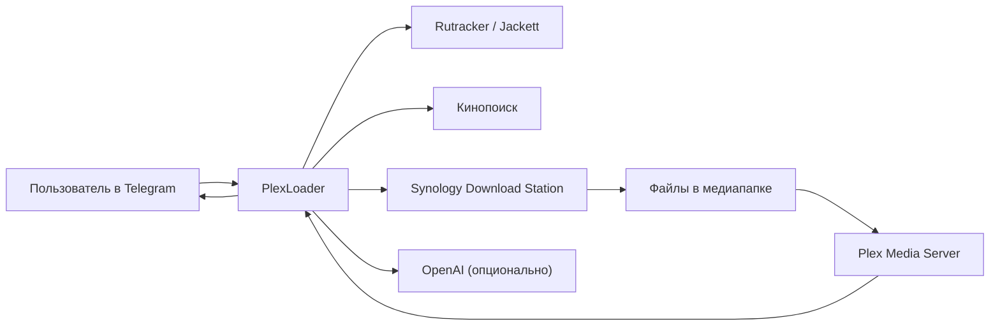
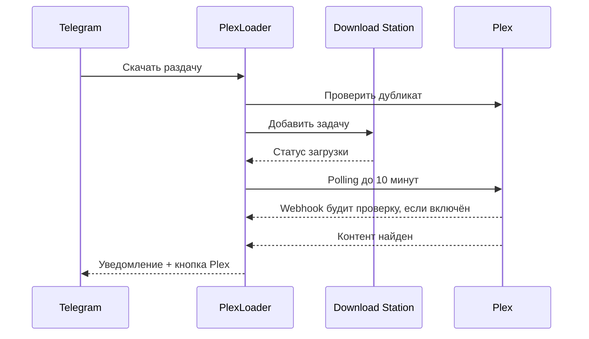

# PlexLoader

[](https://github.com/KiMorev/tg-torrent-bot/actions/workflows/test.yml)
[](https://github.com/KiMorev/tg-torrent-bot/pkgs/container/tg-torrent-bot)

PlexLoader — Telegram-бот для домашнего медиасервера на Synology + Plex.

Он ищет фильмы и сериалы на Rutracker и через Jackett, добавляет `.torrent` и `magnet:` в Synology Download Station, показывает прогресс, следит за новыми сериями, проверяет дубли в Plex и присылает кнопку просмотра, когда контент появился в библиотеке.

Если подключить Кинопоиск и OpenAI, бот становится заметно умнее: показывает подборку свежих фильмов `/new`, помечает уже добавленное в Plex, исправляет опечатки, распознаёт голосовые запросы, объясняет пустую выдачу и даёт короткие пояснения к карточкам.

## Скриншоты

Реальные кадры из Telegram Web, снятые с работающего PlexLoader:

<table>
  <tr>
    <td width="50%"></td>
    <td width="50%"></td>
  </tr>
  <tr>
    <td><b>Старт</b><br>Главные сценарии и подсказки пользователю.</td>
    <td><b>/new</b><br>Свежие фильмы, подписка, обновление и быстрый переход к раздачам.</td>
  </tr>
  <tr>
    <td width="50%"></td>
    <td width="50%"></td>
  </tr>
  <tr>
    <td><b>Поиск</b><br>Быстрый запуск, доп. параметры и выбор трекера.</td>
    <td><b>/status</b><br>Панель загрузок Download Station и YouTube-очереди без перехода в DSM.</td>
  </tr>
</table>

## Зачем это нужно

Обычный путь без PlexLoader выглядит так: открыть трекер, найти подходящую раздачу, скачать torrent, зайти в Download Station, добавить задачу, дождаться загрузки, проверить Plex, обновить библиотеку, найти фильм.

С PlexLoader путь короче:

1. Написать боту название фильма, сериала, ссылку Кинопоиска или голосовое.
2. Выбрать раздачу в Telegram.
3. Получить уведомление о завершении и кнопку открытия в Plex.



## Возможности

### Поиск и скачивание

- Поиск по обычному тексту: `Дюна 2`, `Во все тяжкие 3 сезон`, `Fallout 1080p`, `Клиника все сезоны LostFilm`.
- Поиск по ссылке Кинопоиска: бот извлекает название, год и тип контента, а параметры вроде `4к`, `с субтитрами`, `все сезоны` можно написать рядом со ссылкой.
- Голосовой поиск через OpenAI Whisper, если задан `OPENAI_API_KEY`; распознанный текст проходит тот же разбор намерения, что и обычный запрос.
- Поиск учитывает личные предпочтения из `/settings`: качество, Original, субтитры и предпочитаемые переводы.
- Настройка `Что скачать`: `одна раздача` для обычного поиска или `сериал целиком` для выбора эталонной раздачи и сборки плана по сезонам.
- Дополнительные параметры: `4K`, `1080p`, `720p`, любое качество, оригинальная дорожка, субтитры.
- Выбор трекеров Jackett прямо из Telegram.
- Если в запросе явно указана озвучка, бот ищет её среди найденных релизов; если такой озвучки нет, показывает альтернативы с понятным предупреждением.
- Прямой Rutracker-поиск и fallback на него, если Jackett не смог скачать раздачу.
- Если поиск ничего не нашёл или источник временно упал, бот показывает применённые ограничения и предлагает следующий шаг: повторить поиск, снять качество, расширить трекеры или закрыть экран. При включённом GPT на настоящей пустой выдаче появляется короткая подсказка о вероятной причине.
- Если раздача найдена, но загрузку не удалось добавить, бот объясняет причину и предлагает повторить сейчас или поставить скачивание в очередь.
- Загрузка отправленных в чат `.torrent`-файлов и `magnet:`-ссылок.
- Опциональный YouTube-inbox: если включён `YOUTUBE_DOWNLOADS_ENABLED`, бот распознаёт ссылку YouTube в чате, показывает metadata и доступные совместимые качества до 1080p, ставит ролик в отдельную очередь и сохраняет файл в NAS-папку для Plex.

### YouTube inbox

YouTube-download выключен по умолчанию и включается отдельным рубильником. В MVP бот работает только с публично доступными роликами, которые `yt-dlp` может скачать без cookies и без обхода аккаунтных ограничений. Транскодирование не запускается: выбирается MP4/H.264/AAC до `YOUTUBE_MAX_HEIGHT`, обычно до `1080p`; если совместимого качества нет, бот просит выбрать доступный вариант или сообщает, что ролик не поддержан.

После отправки ссылки `youtube.com/watch`, `youtu.be` или `youtube.com/shorts` бот показывает название, канал, длительность, доступные качества и кнопку скачивания. Если ролик уже есть в очереди или уже скачан, бот не создаёт дубль; когда Plex уже видит скачанный ролик, в ответе появляется кнопка `▶️ Смотреть в Plex`. Очередь хранится в `youtube_downloads.json`; активная загрузка одна, чтобы не перегружать DS223. Статусная карточка показывает checklist: позицию в очереди, подготовку, скачивание видео, при раздельном формате скачивание аудио, сборку MP4, обложку и metadata; из карточки можно перейти к списку загрузок. Временные сетевые сбои YouTube бот повторяет несколько раз и показывает retry в этой же карточке; если скачать всё равно не удалось, он присылает короткую причину без технических URL, кнопку `🔄 Повторить` и чистит временные `.part`-файлы задачи. Если MP4 уже скачан, но Plex metadata или обложку не удалось записать, загрузка остаётся успешной, а бот показывает предупреждение. После завершения карточка удаляется, а бот присылает отдельное уведомление; если включён Plex polling, в нём видно, что бот ждёт появления ролика в Plex. Файл сохраняется в `/youtube_storage/<channel>/<title> [video_id]/<title>.mp4` вместе с `poster.jpg`, `fanart.jpg` и `info.json`; `video_id` входит в техническое имя папки для уникальности и остаётся в `info.json`, а не в названии Plex-карточки. В папке канала бот также создаёт вертикальный `channel-poster.jpg` из аватара YouTube-канала, если его удалось получить, либо `channel-poster.png` с названием канала; для аватара подбирается контрастная подложка, чтобы логотип не сливался с фоном Plex-постера. В MP4 бот прописывает `title`, `artist=<channel>`, `album=<channel>` и дату, чтобы Plex мог использовать канал как collection/category при включённых локальных metadata. Когда Plex находит ролик, бот best-effort назначает `channel-poster.*` постером коллекции канала и закрепляет этот постер, чтобы Plex не пересобирал автоколлаж.

Для Plex рекомендуется отдельная shared folder `/volume1/youtube` и отдельная библиотека `YouTube` типа `Другие видео`. Так ролики не попадают в существующие библиотеки `Фильмы` и `Телепередачи`. Если включён `YOUTUBE_PLEX_POLL_AFTER_DOWNLOAD`, бот после скачивания ждёт появления ролика в этой библиотеке и присылает кнопку `▶️ Смотреть в Plex`, когда Plex вернул metadata.

### Предпочтения поиска

Команда `/settings` открывает личные предпочтения поиска. Бот учитывает их как пожелания к новым поискам; если точного варианта нет, он покажет альтернативы с пояснением:

- качество: `4K`, `1080p`, `720p` или любое;
- Original;
- субтитры;
- предпочитаемые переводы, например `LostFilm` или `NewStudio`.

Предпочтения из `/settings` — мягкий приоритет: подходящие релизы поднимаются выше, а если точного варианта нет, бот показывает другие варианты с пояснением. Это относится к Original, субтитрам и переводам. В bulk-подборе перевод из `/settings` или запроса тоже работает как мягкий бонус к подбору сезонов; строгим ограничением озвучка становится только после ручного выбора в профиле.

### Сериалы и подписки

Если нужно скачать сериал целиком, не нужна отдельная команда: в настройках поиска выберите `🎚 Что скачать: сериал целиком`. Бот найдёт только сериальные раздачи, предложит выбрать эталон, а затем откроет профиль bulk-подбора. Озвучка выбирается после эталона, когда бот уже видит реальные дорожки выбранного релиза. Если в запросе явно указан сезон, бот мягко подскажет, что можно искать одну раздачу или собрать план по всем сезонам.

Для сериальных раздач `⬇️ N` открывает выбор действий:

- `⬇️ Скачать сейчас`
- `📚 Скачать недостающие сезоны` — выбрать профиль подбора, собрать план по сезонам, Plex и текущим загрузкам; бот сам добирает кандидатов широким и точечным поиском, предлагает скачать выбранные сезоны после подтверждения, а спорные и неполные сезоны выносит в ручной разбор

Для неполных сезонов в этом же меню появляются дополнительные варианты:

- `⬇️ Скачать сейчас + новые серии по мере выхода`
- `⬇️ Скачать только доступные`
- `📦 Скачать, когда сезон завершится`

Перед сборкой bulk-плана бот показывает короткий профиль подбора: качество, Original, субтитры и текущую политику озвучки. По умолчанию используется `любая из эталона`; предпочитаемый перевод только поднимает подходящие сезоны выше и не блокирует другие найденные варианты. Озвучку можно раскрыть прямо на этом экране и выбрать `одна на все сезоны` или ручной выбор одной-двух студий, а качество/Original/субтитры спрятаны в `⚙️ Остальные настройки`. Сборку можно отменить во время поиска: бот остановится после текущего сетевого шага и не сохранит план. Если сборка затянулась, бот обновит тот же экран мягким статусом и оставит кнопку отмены. Если широкий поиск Jackett упёрся в лимит, бот доберёт все нужные сезоны точечными запросами; предупреждение останется только если точечный добор тоже не снял риск неполной выдачи. Если после проверки скачивать или разбирать нечего, бот покажет финальный экран и не сохранит план. Качество в bulk-плане работает как предпочтение с защитой: если для сезона найдено выбранное качество, другое качество не выбирается автоматически; если выбранного качества нет вообще, бот может выбрать лучший другой вариант и явно пишет в плане, например `1080p не найдено, выбран 720p`. Если временно не удалось добавить выбранный сезон в Download Station, бот поставит его в очередь на фоновый повтор и обновит план после успеха. После `⬇️ Скачать выбранные` бот не теряет спорные сезоны: показывает сколько осталось разобрать и оставляет кнопки `⚙️ Разобрать оставшиеся` / `⬅️ К плану`. Если в выдаче есть паки сезонов, бот показывает кнопку `📦 Показать паки сезонов`; пак можно скачать только вручную после отдельного подтверждения, и тогда сезоны из диапазона пака в этом плане помечаются как скачанные паком. Если после просмотра плана настройки нужно поменять, кнопка `🔄 Пересобрать план` возвращает к профилю и запускает новую сборку; прежний сохранённый план скрывается как пересобранный. В bulk-плане кнопка `⚙️ Разобрать спорные` появляется, если сезон нельзя выбрать автоматически, сезон не найден или постоянная ошибка добавления требует ручного решения. Для спорных кандидатов GPT может добавить короткую подсказку; кнопка `✅ Выбрать` только добавляет вариант в план, а в Download Station он уйдёт после общего подтверждения `⬇️ Скачать выбранные`. Для спорного или ненайденного сезона можно нажать `🔄 Искать мягче`: бот точечно ищет этот сезон без жёстких требований к качеству, Original, субтитрам и озвучке, но всё равно просит выбрать раздачу вручную. Для ошибки добавления можно повторить тот же вариант, выбрать другую найденную раздачу или пропустить сезон. Для неполного сезона можно скачать доступные серии, скачать доступные и следить за новыми, ждать полного сезона или получать только уведомления.

Команда `/seasons` — «Докачать серии и сезоны» — помогает добрать недостающие серии и целые сезоны в Plex. При открытии бот сразу сверяет Plex с историей загрузок и каталогом сезонов, но первым экраном всегда показывает неполные сезоны. В списке неполных сезонов можно переключаться между `🙋 Моё` и `🌐 Всё`, листать кандидатов по 10 штук и открывать карточку сезона: сколько серий есть в Plex, какие номера эпизодов пропущены внутри сезона, какая прошлая тема известна, какой профиль скачивания был сохранён и есть ли точная подписка на эту Rutracker-тему. Ненужный сезон можно скрыть лично для себя; если есть скрытые сезоны, список показывает счётчик и кнопку `🙈 Показать скрытые`, а в скрытом списке сезон можно вернуть. В карточке неполного сезона кнопка `🔔 Следить за сезоном` создаёт подписку именно на Plex-сезон: бот периодически ищет раздачи с сериями, которых ещё нет в Plex, уверенное совпадение скачивает автоматически, а спорные варианты присылает сообщением без автозагрузки. Если Plex позже показывает сезон полным, такая подписка снимается автоматически. Если сохранённая тема Rutracker обновилась, бот скачает обновлённый torrent из той же темы; для всё ещё неполного сезона сразу сохранит подписку на следующие серии. Если прошлой темы нет или в той же теме новых серий нет, можно поискать похожие раздачи: `⬇️ N` скачает выбранную раздачу и при неполном сезоне сохранит подписку, а `🔔 N` только подпишет на выбранную тему без скачивания. Другой `topic_id` бот называет обновлённой раздачей, а не докачкой.

Если похожая раздача в `/seasons` не содержит недостающих для Plex серий, бот не отправляет её в Download Station. Для неполной раздачи он сохраняет подписку на выбранную тему и ждёт следующих серий.

В этом же экране есть кнопка `🧩 Отсутствующие сезоны`. Бот сверяет Plex с TMDB/TVmaze, показывает стартовавшие сезоны из каталога и не считает будущий сезон с нулём вышедших серий отсутствующим в Plex. Список группирует целиком отсутствующие сезоны по сериалу и показывает, например, `Нет в Plex: S07, S09`; если TMDB и TVmaze спорят о количестве серий, сезон остаётся в списке, а спор помечается отдельно. Если один каталог временно недоступен, бот пишет, какой источник подтвердил сезон и какой не ответил. Из карточки сериала можно собрать bulk-план для всех отсутствующих сезонов, открыть подбор только для одного `Sxx` или нажать `🔔 Следить за Sxx`: такая подписка периодически ищет раздачу отсутствующего сезона, уверенное совпадение скачивает автоматически, а спорные варианты присылает сообщением. Если качество не удалось вывести из Plex/истории, план стартует с личного дефолта поиска, обычно `1080p`, а не с любого качества. Дальше работает обычный bulk-флоу с `⬇️ Скачать выбранные`, ручным разбором спорных сезонов и существующими подписками на partial-сезоны. Отдельной подписки на будущие сезоны всего сериала в этом режиме пока нет.

`🔔 N` остаётся отдельной кнопкой для действий только с уведомлениями:

- `🔔 Уведомлять о новых сериях`
- `🎯 Сообщить, когда сезон завершится`

Подписка хранит две независимые политики: когда уведомлять и когда скачивать. Поэтому бот может, например, молча ждать финала сезона и скачать его одним торрентом, либо уведомлять о каждой новой серии без автозагрузки. В `/subs` можно посмотреть, как бот следит за подпиской — по теме Rutracker, по поиску Jackett или по неполному сезону Plex — текущий прогресс, статус и изменить эти правила для уже созданной подписки.

После добавления сериальной раздачи появляется кнопка `🔎 Другой сезон`. Если Кинопоиск знает количество сезонов, бот показывает кнопки сезонов; если нет — предлагает ручной ввод.

### Новинки `/new`

`/new` показывает топ свежих фильмов и мультфильмов из трекеров:

- берёт текущий и прошлый год;
- фильтрует CAM/TS, сериалы, adult-раздачи, сборники, трейлеры и спортивные трансляции;
- учитывает качество, размер, сиды, свежесть, страну и рейтинг Кинопоиска;
- показывает топ-10 карточек;
- показывает и пушит только карточки, подтверждённые прошлым top-10, чтобы случайный transient refresh не попадал пользователю;
- добавляет метку `🆕` для фильмов, которые конкретный пользователь ещё не открывал в `/new`; после успешного скачивания из уведомления метка для этого пользователя исчезает;
- добавляет `✅ 1080` / `✅ 2160`, если фильм уже есть в Plex;
- умеет присылать push о новых подходящих фильмах подписчикам `/new`: до трёх KP-обогащённых карточек, которых ещё нет в Plex, ссылка на Кинопоиск в названии при наличии URL, постер главной новинки при наличии постера и обычный текстовый fallback при ошибке;
- в push можно сразу скачать один фильм или все доступные фильмы из уведомления; выбор раздачи мягко учитывает пользовательские настройки качества, Original, субтитров и озвучки, а GPT используется только как tie-break для близких по score вариантов;
- если push открывает сохранённый snapshot, а текущий `/new` уже изменился, бот явно предупреждает об этом и даёт кнопку свежего списка.

Кнопки `/new`:

- карточки `🎬 1...10` — открыть найденные раздачи по фильму;
- `⬇️ 1...3` в push — поставить скачивание выбранной новинки из snapshot уведомления;
- `⬇️ Скачать все N` в push — подтвердить массовую постановку доступных новинок из уведомления;
- `🎬 Открыть /new` в push — открыть snapshot уведомления отдельным сообщением и удалить исходное push-уведомление;
- `🔄 Свежий /new` — открыть актуальный список, если snapshot уведомления уже отличается от текущего `/new`;
- `🔔 Подписаться на /new` / `🔕 Отписаться от /new`;
- `🔄 Обновить`;
- `✖️ Закрыть`.

Если при обновлении `/new` один из источников временно упал, бот не заменяет хороший кэш подозрительно коротким списком и не отправляет push по деградированному refresh. Для Jackett он дополнительно запоминает состояние отдельных индексеров: временно нестабильные индексеры проверяются точечно по backoff, а `/new` использует прошлый хороший снимок по ним, пока индексер не подтвердит восстановление.

### Plex

Plex-интеграция опциональна, но именно она делает PlexLoader цельным:

- перед скачиванием бот предупреждает, если фильм или сезон уже есть в Plex;
- в результатах поиска и на экране выбора сезона может заранее подсказать, что фильм/сезон уже есть в Plex, есть в лучшем качестве или может быть улучшен;
- для уже существующего контента показывает качество и предлагает скачать всё равно или заменить версией лучше;
- после завершения загрузки проверяет имена файлов сериала; если эпизоды явно не в Plex-формате, предлагает план переименования и не запускает ожидание Plex до решения пользователя; если уведомление пропустили, тот же экран можно открыть из карточки задачи или командой `/normalize`;
- после завершения загрузки до 10 минут ждёт появления фильма или сезона в Plex;
- опционально принимает Plex webhook в LAN и будит эту проверку сразу после события Plex;
- присылает уведомление `✅ ... добавлен в Plex`;
- добавляет кнопку `▶️ Смотреть в Plex`, когда Plex нашёл конкретный фильм или сезон;
- если Plex не подтвердил появление за время ожидания, предлагает открыть задачу и проверить статус загрузки;
- в `/admin` показывает радар файлов без матча metadata;
- может присылать администратору push, когда в Plex появился новый несматченный файл.
- в радаре и push по несматченным файлам имя файла ведёт в Plex Web на карточку metadata, если Plex уже отдал `ratingKey`.



### Администрирование

`/admin` — компактная панель состояния:

- Download Station: всего задач, активные, завершённые, ошибки;
- если Download Station не отвечает быстро, `/admin` остаётся доступным и показывает timeout вместо долгого ожидания;
- подписки на серии и `/new`;
- зависшие уведомления и кнопка сброса счётчиков;
- состояние интеграций: Rutracker, Jackett, Кинопоиск, Plex, публичные трекеры;
- диагностика внешних сервисов;
- управление пользователями;
- админская рассылка всем пользователям с доступом: шаблон, предпросмотр и подтверждение;
- выбор Jackett-трекеров для рейтинга `/new`;
- управление KP-кэшем;
- радар Plex-файлов без матча;
- блок `📀 Хранилище` и переименование файлов сериалов для Plex, если в контейнер проброшен `/storage`.

`/status` показывает загрузки Download Station и задачи YouTube-очереди. Для администратора есть переключатель `🙋 Мои загрузки` / `🌐 Все загрузки`; в общем списке рядом с задачей виден владелец, включая имя пользователя, если оно известно боту. Обычный пользователь видит только свои задачи. Сверху есть короткая сводка по активным, завершённым и проблемным задачам; каждая карточка показывает источник `Download Station` или `YouTube`. Для YouTube-роликов бот не показывает технические `video_id/job_id` в пользовательских карточках и списках. Завершённые и `seeding`-задачи Download Station показываются компактно с датой, временем, объёмом и сроком автоочистки, если автоочистка включена для этого статуса. Если бот видит, что завершённый сериал можно безопасно переименовать для Plex, в карточке появляется кнопка `🛠 Переименовать для Plex`. YouTube-ролики не удаляются автоочисткой: их можно удалить из карточки ролика или отдельной кнопкой `🧹 Удалить все YouTube-ролики` в списке. После удаления YouTube-ролика бот best-effort запускает обновление Plex-библиотеки `YouTube`, чтобы Plex быстрее убрал отсутствующий файл; если Plex временно недоступен, refresh уходит в фоновый retry, а `section not found` повторяется только один раз. Если файл уже удалён на NAS вручную, бот всё равно уберёт устаревшую YouTube-запись из `/status`; небезопасный путь вне YouTube-папки будет пропущен. Кнопка `🧹 Удалить завершенные` работает только с завершёнными задачами Download Station. Если Download Station пометил BT-задачу ошибкой уже после 100% скачивания и не отдал конкретный `error_detail` или вернул `unknown`, PlexLoader считает это мягким завершением: показывает статус `Скачано полностью`, объясняет, что DS показал ошибку, но файл скачан полностью, и продолжает проверку Plex.

## Быстрый старт на Synology

Установщик ведёт пользователя от пустой папки до запущенного контейнера: сначала предлагает выбрать возможности, потом спрашивает только нужные данные и сразу проверяет введённые token, URL и API keys там, где сервис даёт безопасный read-only endpoint. Базовое ядро Telegram + Synology Download Station обязательно; Rutracker, Jackett, Plex, `/new`, Кинопоиск, TMDB и OpenAI можно включить в том же мастере или позже повторным запуском.

### Что понадобится

- Synology с установленным `Container Manager` / Docker.
- Архитектура устройства `linux/amd64` или `linux/arm64`: готовый образ в GHCR публикуется для этих платформ.
- SSH-доступ к NAS пользователем, который может запускать Docker.
- Новый Telegram-бот из [@BotFather](https://t.me/BotFather): понадобится только `BOT_TOKEN`.
- DSM-пользователь для PlexLoader, например `tg_bot_ds`, с доступом к Download Station и папке загрузки.

### Установка одной командой

Подключитесь к NAS по SSH и выполните:

```bash
curl -fsSL https://raw.githubusercontent.com/KiMorev/tg-torrent-bot/main/install.sh | sh
```

Если `curl` не установлен, можно так:

```bash
wget -qO- https://raw.githubusercontent.com/KiMorev/tg-torrent-bot/main/install.sh | sh
```

Установщик:

- проверит Docker и `docker compose` / `docker-compose`;
- создаст папку `/volume1/docker/plexloader`;
- скачает [`compose.yaml`](compose.yaml) и мастер [`scripts/setup_wizard.py`](scripts/setup_wizard.py);
- отключит необязательный `/storage` mount, если на NAS нет `/volume1/video`;
- спросит, какие возможности включить;
- проведёт по настройке Telegram, Download Station и выбранных интеграций;
- создаст `.env`;
- запустит контейнер;
- проверит, что `tg_torrent_drop` реально поднялся, а при ошибке покажет последние логи.

### Что спросит мастер

1. Какие возможности включить: Rutracker, Jackett, Plex, `/new`, Кинопоиск, TMDB, OpenAI, YouTube-download.
2. `BOT_TOKEN`: откройте [@BotFather](https://t.me/BotFather), создайте бота командой `/newbot` и скопируйте token.
3. Telegram `chat_id`: мастер попросит написать `/start` вашему боту и сам попробует прочитать `chat_id` через Telegram `getUpdates`. Ручной ввод нужен только если Telegram не отдаст update.
4. DSM URL: по умолчанию `https://host.docker.internal:5001`. Это адрес DSM из контейнера; установщик умеет проверить его с NAS через локальный fallback.
5. DSM account / password: пользователь Synology с доступом к Download Station.
6. Папка назначения Download Station: обычно `video` или другая папка, настроенная в Download Station.
7. Только для выбранных интеграций: логин/пароль Rutracker, Jackett URL/API key/indexers, Plex URL/token/movie-секция, API keys Кинопоиска/TMDB/OpenAI, путь NAS и имя Plex-библиотеки для YouTube.

Перед каждым внешним параметром мастер коротко пишет, зачем он нужен, где его взять, пример значения и что будет недоступно, если возможность пропустить. Если DSM использует самоподписанный сертификат, мастер сам попробует fallback `DS_VERIFY_SSL=false`. Download Station проверяется логином, списком задач и best-effort проверкой shared folder для `DS_DESTINATION`; если проверка не проходит, установщик покажет причину и предложит ввести данные заново. Если включён YouTube-download, `install.sh` проверит, что `YOUTUBE_NAS_PATH` уже существует; если блок выключен, установщик уберёт необязательный `/youtube_storage` mount из установленного `compose.yaml`.

### Ручной fallback

Если автоматическая установка не подходит, можно развернуть вручную:

1. Создайте папку `/volume1/docker/plexloader`.
2. Скачайте туда [`compose.yaml`](compose.yaml).
3. Создайте `.env` по примеру [`.env.example`](.env.example).
4. В Synology Container Manager создайте проект из этой папки и запустите его.

Минимальный `.env` для ручного запуска:

```env
BOT_TOKEN=123456:replace_me
ALLOWED_CHAT_IDS=123456789
ADMIN_CHAT_IDS=123456789
STATE_DIR=/data

DS_URL=https://host.docker.internal:5001
DS_ACCOUNT=tg_bot_ds
DS_PASSWORD=replace_me
DS_DESTINATION=video
DS_VERIFY_SSL=false
```

### Проверить запуск

В Telegram:

- `/ping` должен ответить `pong`;
- `/status` должен показать задачи Download Station;
- `/admin` должен открыть панель администратора;
- `/help` покажет доступные возможности с учётом включённых интеграций.

### Повторный запуск мастера

Если нужно включить новую интеграцию или исправить token, запустите установщик повторно из той же папки или той же one-line командой. Мастер прочитает существующий `.env`, предложит оставить прежние значения по Enter и сохранит уже заданные технические переменные, которыми сам не управляет.

После изменения `.env` мастер сам запустит `docker compose up -d`. Если вы редактировали `.env` вручную, примените настройки из папки установки:

```bash
cd /volume1/docker/plexloader
docker compose up -d
```

### Где взять ключи и параметры

| Параметр | Где взять | Пример | Можно пропустить |
|---|---|---|---|
| `BOT_TOKEN` | Telegram → [@BotFather](https://t.me/BotFather) → `/newbot` → скопировать token после создания бота. | `123456789:AA...` | Нет |
| Telegram `chat_id` | Мастер попросит отправить `/start` боту и сам прочитает `getUpdates`; fallback — команда `/id` после запуска или ручной ввод. | `123456789` | Нет |
| `DS_URL` | Адрес DSM. Для контейнера обычно подходит `https://host.docker.internal:5001`; мастер проверяет его с NAS через fallback. | `https://host.docker.internal:5001` | Нет |
| `DS_ACCOUNT`, `DS_PASSWORD` | DSM-пользователь с доступом к Download Station и папке загрузки. Лучше отдельный пользователь, например `tg_bot_ds`. | `tg_bot_ds` | Нет |
| `DS_DESTINATION` | Shared folder или путь Download Station. Обычно имя общей папки из DSM, например `video`. | `video` | Нет |
| `RUTRACKER_USERNAME`, `RUTRACKER_PASSWORD` | Логин и пароль аккаунта rutracker.org. Если Rutracker требует капчу, войдите в браузере с того же IP и решите её вручную. | `my_login` | Да |
| `JACKETT_URL` | Адрес Jackett в браузере. На NAS или в LAN часто `http://<NAS_IP>:9117`. | `http://192.168.1.10:9117` | Да |
| `JACKETT_API_KEY` | Jackett → Dashboard → поле `API Key` вверху страницы. | `abc123...` | Да |
| `JACKETT_INDEXERS` | Jackett → список настроенных indexers; мастер покажет найденные id. `all` включает все настроенные. | `all` или `rutracker,kinozal` | Да |
| `PLEX_URL` | Мастер обычно находит Plex Media Server после входа через Plex в браузере. Если не нашёл: укажите адрес сервера, не Plex Web; обычно `http://<NAS_IP>:32400`. | `http://192.168.1.10:32400` | Да |
| `PLEX_TOKEN` | Мастер получает token через браузерный Plex auth. Ручной fallback: Plex Web → карточка любого фильма → `Get Info` → `View XML` → параметр `X-Plex-Token` в URL. | `xYz...` | Да |
| `PLEX_MOVIE_SECTION` | Мастер получает список секций Plex и выбирает movie-секцию. При ручной настройке можно оставить пустым: бот найдёт первую movie-секцию сам. | `1` | Да |
| `PLEX_DEEPLINK_BASE_URL` | Ваша HTTPS-страница с [`web/plex.html`](web/plex.html), если хотите открывать Plex-приложение на телефоне через redirect. | `https://nas.example.com/plex.html` | Да |
| `PLEX_WEBHOOK_TOKEN` | Любая длинная случайная строка для webhook URL. Можно сгенерировать password manager'ом. | `long-random-token` | Да |
| `KINOPOISK_API_KEY` | [kinopoiskapiunofficial.tech](https://kinopoiskapiunofficial.tech) → личный кабинет → API key. | `01234567-89ab-cdef-0123-456789abcdef` | Да |
| `TMDB_API_TOKEN` | [themoviedb.org](https://www.themoviedb.org) → Settings → API → `API Read Access Token`. Нужен именно Bearer token, не короткий API key. | `eyJhbGciOi...` | Да |
| `OPENAI_API_KEY` | [platform.openai.com](https://platform.openai.com) → API keys. Лимит расходов задайте в Settings → Limits. | `sk-...` | Да |

## Настройка интеграций

Полный список переменных лежит в [`.env.example`](.env.example). Ниже — что реально важно настроить осознанно. Большинство пользовательских интеграций удобнее включать через мастер, а вручную редактировать `.env` стоит для тонких параметров и fallback-сценариев.

### Доступ

| Переменная | Что делает |
|---|---|
| `ALLOWED_CHAT_IDS` | Список chat_id, которым разрешён доступ. Можно несколько через запятую. |
| `ADMIN_CHAT_IDS` | Администраторы. Если пусто, админами считаются все из `ALLOWED_CHAT_IDS`. |
| `ACCESS_APPROVALS_ENABLED` | Если `true`, новые пользователи могут запросить доступ у администратора. |

### Поиск

| Переменная | Что делает |
|---|---|
| `RUTRACKER_USERNAME`, `RUTRACKER_PASSWORD` | Включают прямой поиск и скачивание с Rutracker. Нужно задавать обе. |
| `RUTRACKER_MAX_RESULTS` | Максимум результатов прямого Rutracker-поиска. |
| `JACKETT_URL`, `JACKETT_API_KEY` | Включают поиск через Jackett. Нужно задавать обе. |
| `JACKETT_INDEXERS` | Индексеры Jackett для обычного поиска. По умолчанию `all`. |
| `JACKETT_MAX_RESULTS` | Сколько результатов показывать из Jackett. |
| `JACKETT_FETCH_LIMIT` | Сколько сырых результатов запрашивать у Jackett до фильтрации. |
| `JACKETT_SEARCH_TIMEOUT_SECONDS` | Сколько секунд бот ждёт ответ поиска Jackett. По умолчанию `90`, потому что некоторые индексеры возвращают кэш только после своего 60-секундного timeout. |
| `JACKETT_WARMUP_ENABLED` | Включает лёгкий фоновый прогрев Jackett, если Jackett настроен. |
| `JACKETT_WARMUP_INTERVAL_SECONDS` | Как часто запускать прогрев. По умолчанию 15 минут. |
| `JACKETT_WARMUP_QUERY` | Короткий запрос для прогрева. По умолчанию `1080p`. |
| `JACKETT_WARMUP_INDEXERS` | `auto` берёт `JACKETT_INDEXERS`, а при `all` ротирует все настроенные индексеры пачками. Можно задать список через запятую. |
| `JACKETT_WARMUP_BATCH_SIZE` | Сколько индексеров греть за один цикл. По умолчанию `3`. |
| `KINOPOISK_API_KEY` | Включает поиск по ссылкам Кинопоиска и обогащение `/new`. |
| `TMDB_API_TOKEN` | Включает точное определение количества уже вышедших серий в сезоне для `/seasons` и поиск целиком отсутствующих стартовавших сезонов по Plex external ids. TVmaze без ключа дополнительно проверяет `imdb`/`tvdb` совпадения, отсекает ещё не стартовавшие сезоны и помечает конфликтующие totals. Нужен верхний TMDB `API Read Access Token`. |

Для комфортной работы достаточно включить Rutracker или Jackett. Лучше включить оба: Jackett даёт широкий поиск, прямой Rutracker используется как fallback. Если Jackett включён, бот периодически делает короткий фоновый запрос к небольшой пачке индексеров, чтобы первый пользовательский поиск после простоя реже попадал в холодный старт. Индексеры с недавними timeout/network/startup-ошибками проверяются точечно чаще, а ошибки класса Cloudflare/cookie/auth считаются ручными и не ретраятся агрессивно.

### Plex

| Переменная | Что делает |
|---|---|
| `PLEX_URL` | URL Plex Media Server, например `http://192.168.1.103:32400`. |
| `PLEX_TOKEN` | Token Plex. Мастер установки получает его через Plex auth в браузере; ручной ввод нужен только как fallback. |
| `PLEX_MOVIE_SECTION` | ID movie-секции. Можно оставить пустым: бот найдёт первую movie-секцию сам. |
| `PLEX_DEEPLINK_BASE_URL` | HTTPS-страница-редирект для открытия Plex-приложения с iOS/Android. Если пусто, кнопки ведут в Plex Web. |
| `PLEX_WEBHOOK_ENABLED` | Включает LAN endpoint для Plex webhook. Webhook не заменяет polling, а будит текущую проверку появления файла в Plex. |
| `PLEX_WEBHOOK_PORT` | Порт webhook endpoint. По умолчанию `8099`; compose публикует этот порт на хост. |
| `PLEX_WEBHOOK_TOKEN` | Shared token для `POST /plex/webhook` и `GET /plex/webhook/health`. Не публикуйте endpoint наружу без отдельной защиты. |
| `PLEX_WEBHOOK_DEBOUNCE_SECONDS` | Минимальный интервал между принятыми webhook-триггерами. По умолчанию `10`. |

Мастер установки по умолчанию показывает ссылку Plex auth: откройте её в браузере, войдите в Plex и подтвердите доступ. После этого мастер сам получает token, находит доступные Plex URL из аккаунта, проверяет их с NAS и предлагает movie-секцию. Служебный `PLEX_AUTH_CLIENT_ID` мастер сохраняет в `.env` сам; искать его вручную не нужно.

Если браузерный auth не сработал, используйте ручной fallback для token: в Plex Web откройте карточку любого фильма, выберите `Get Info` → `View XML` и возьмите параметр `X-Plex-Token` из открывшегося URL. Если пункт меню отличается в вашей версии Plex Web, можно открыть DevTools → Network и найти `X-Plex-Token` в запросах к Plex.

Чтобы включить Plex webhook, задайте `PLEX_WEBHOOK_ENABLED=true`, сгенерируйте длинный `PLEX_WEBHOOK_TOKEN` и добавьте в Plex Web → Settings → Webhooks URL:

```text
http://<NAS_IP>:8099/plex/webhook?token=<PLEX_WEBHOOK_TOKEN>
```

Проверка доступности endpoint:

```text
http://<NAS_IP>:8099/plex/webhook/health?token=<PLEX_WEBHOOK_TOKEN>
```

После изменения `.env` или `compose.yaml` примените конфигурацию командой `docker compose up -d`. Если запускаете локальную сборку из checkout, используйте `docker compose up -d --build`.

Для полной точности `/seasons` нужен `TMDB_API_TOKEN`: Plex даёт external ids сериала, а TMDB по ним возвращает количество уже вышедших эпизодов в конкретном сезоне и список стартовавших сезонов сериала для missing-проверки. Если у Plex есть `imdb`/`tvdb`, бот дополнительно сверяет сезон с TVmaze без отдельного ключа и скрывает ещё не начавшиеся сезоны, чтобы не показывать будущий `Sxx` как отсутствующий в Plex. Без TMDB бот не считает Plex `leafCount` общим размером сезона; часть проверок может сработать по TVmaze, но сезон не показывается как уверенно неполный без внешнего total.

### YouTube

| Переменная | Что делает |
|---|---|
| `YOUTUBE_DOWNLOADS_ENABLED` | Главный рубильник YouTube-download. Если `false`, YouTube-ссылка не уходит в обычный поиск, а бот сообщает, что блок выключен. |
| `YOUTUBE_NAS_PATH` | Путь NAS, который compose монтирует внутрь контейнера. Для выбранной схемы: `/volume1/youtube`. Папка должна существовать до запуска контейнера. |
| `YOUTUBE_DOWNLOAD_DIR` | Путь внутри контейнера, куда бот пишет файлы. По умолчанию `/youtube_storage`. |
| `YOUTUBE_MAX_DURATION_MINUTES` | Максимальная длительность ролика. По умолчанию `300` минут. |
| `YOUTUBE_MAX_HEIGHT` | Верхний предел качества без транскодирования. По умолчанию `1080`. |
| `YOUTUBE_MIN_HEIGHT` | Нижний предел качества в кнопках. По умолчанию `640`, чтобы скрыть слишком низкие варианты. |
| `YOUTUBE_AUDIO_LANGUAGE` | Язык аудиодорожки, который бот прописывает в MP4 без транскодирования. По умолчанию `und`, чтобы Plex не показывал ложный английский; можно поставить `rus` или `auto`, чтобы не трогать metadata. |
| `YOUTUBE_MAX_PARALLEL` | Зарезервировано под будущую параллельность; в MVP активная загрузка всё равно одна. |
| `YOUTUBE_MAX_QUEUE_SIZE`, `YOUTUBE_MAX_QUEUE_PER_CHAT` | Опциональные лимиты очереди; `0` означает без жёсткого лимита. Активная загрузка в MVP всё равно одна. |
| `YOUTUBE_MIN_FREE_GB` | Минимум свободного места в YouTube-папке перед стартом загрузки. |
| `YOUTUBE_PLEX_LIBRARY_NAME` | Имя отдельной Plex-библиотеки для роликов. По умолчанию `YouTube`. |
| `YOUTUBE_PLEX_SECTION` | ID Plex-секции, если нужно задать явно. Если пусто, бот ищет секцию по `YOUTUBE_PLEX_LIBRARY_NAME`. |
| `YOUTUBE_PLEX_REFRESH_AFTER_DOWNLOAD` | Принудительно вызвать refresh Plex-секции после скачивания. По умолчанию `true`, потому что bind mount не всегда сразу будит автоскан Plex. |
| `YOUTUBE_PLEX_POLL_AFTER_DOWNLOAD` | Ждать появления ролика в Plex и прислать отдельное уведомление. По умолчанию `true`. |

Минимальная настройка на NAS:

1. В DSM создать shared folder `youtube`.
2. Дать пользователю бота права на запись, Plex - права на чтение.
3. В Plex добавить библиотеку `YouTube` типа `Другие видео` и указать `/volume1/youtube`.
4. В мастере установки включить YouTube-download, указать `YOUTUBE_NAS_PATH=/volume1/youtube` и имя Plex-библиотеки `YouTube`.
5. Применить конфигурацию: `docker compose up -d`, если `.env` редактировался вручную. Для локальной сборки из checkout: `docker compose up -d --build`.

Если Plex уже подключён в мастере, установщик попробует найти библиотеку `YouTube` и записать `YOUTUBE_PLEX_SECTION`. Если библиотека ещё не создана, установка не падает: бот позже попробует найти секцию по `YOUTUBE_PLEX_LIBRARY_NAME`.

### `/new`

| Переменная | Что делает |
|---|---|
| `MOVIE_DISCOVERY_ENABLED` | Включает `/new`. Нужен хотя бы Rutracker или Jackett. |
| `MOVIE_DISCOVERY_INTERVAL_HOURS` | Интервал фонового обновления, по умолчанию 6 ч. |
| `MOVIE_DISCOVERY_RUTRACKER_TM` | Диапазон Rutracker: `1`, `3`, `7`, `14`, `32`, `-1`. |
| `MOVIE_DISCOVERY_JACKETT_REQUIRE_DATE` | Требовать дату публикации от Jackett. |
| `MOVIE_DISCOVERY_JACKETT_MAX_AGE_DAYS` | Максимальный возраст Jackett-раздачи. |
| `MOVIE_DISCOVERY_LIMIT` | Сколько карточек хранить в кэше. В интерфейсе показывается топ-10. |
| `MOVIE_DISCOVERY_MIN_KP_RATING` | Минимальный рейтинг Кинопоиска. |
| `MOVIE_DISCOVERY_QUALITIES` | Качества через запятую, например `1080p` или `1080p,2160p`. |

Трекеры Jackett, которые участвуют именно в рейтинге `/new`, можно переключать без перезапуска: `/admin` → `🎬 Трекеры новинок`.

### Уведомления, очередь и автоочистка

| Переменная | Что делает |
|---|---|
| `TASK_NOTIFICATIONS_ENABLED` | Уведомления о завершении, seeding и ошибках задач. |
| `TASK_NOTIFICATION_STATUSES` | Статусы, по которым отправлять уведомления. |
| `TASK_NOTIFY_EXTERNAL_TASKS` | Уведомлять о задачах, созданных не через бота. Обычно `false`. |
| `NOTIFY_CHAT_IDS` | Дополнительные получатели уведомлений. |
| `AUTO_DELETE_FINISHED_AFTER_HOURS` | Через сколько часов удалять завершённые задачи из Download Station. |
| `AUTO_DELETE_FINISHED_STATUSES` | Какие статусы считать кандидатами на автоудаление. |
| `PENDING_DOWNLOADS_ENABLED` | Очередь отложенных загрузок при временных сбоях трекера. |
| `PENDING_DOWNLOADS_INTERVAL_SECONDS` | Как часто очередь повторяет попытку. |
| `PENDING_DOWNLOADS_TTL_HOURS` | Сколько живёт отложенная заявка. |
| `SUBSCRIPTION_CHECK_INTERVAL_HOURS` | Как часто проверять подписки на серии. |

### Публичные трекеры

| Переменная | Что делает |
|---|---|
| `TRACKERS_MODE` | `auto` включает добавление публичных трекеров к BT-задачам. |
| `TRACKERS_URL` | Источник списка публичных трекеров. |
| `TRACKERS_MAX` | Сколько трекеров добавлять. |
| `TRACKERS_CACHE_TTL_HOURS` | TTL кэша списка трекеров. |
| `TRACKERS_BACKGROUND_ENABLED` | Фоновое обновление кэша. |
| `TRACKERS_BACKGROUND_INTERVAL_SECONDS` | Интервал фонового обновления. |

### OpenAI

| Переменная | Что делает |
|---|---|
| `OPENAI_API_KEY` | Включает голосовой поиск и GPT-улучшения. |
| `VOICE_SEARCH_ENABLED` | Принимать Telegram voice как поисковый запрос. |
| `VOICE_MAX_SECONDS` | Максимальная длина голосового сообщения. |
| `GPT_ENABLED` | Включить GPT-подсказки, проверку KP-матчей и пояснения карточек. |
| `GPT_MODEL` | Модель для GPT-улучшений. По умолчанию `gpt-4o-mini`. |

Голосовой поиск использует Whisper API (`whisper-1`). GPT используется точечно: разбор сложного поискового запроса, did-you-mean и объяснение пустой выдачи, проверка KP-матча, бейджи релизов, пояснения `/new`, подсказки спорных bulk-кандидатов, tie-break близких раздач в push `/new` и метаданные для ручных magnet/`.torrent`. Это pay-per-use, без подписки; лимиты лучше выставить в кабинете OpenAI.

### Хранилище

| Переменная | Что делает |
|---|---|
| `STATE_DIR` | Где хранится JSON-состояние. В Docker по умолчанию `/data`. |
| `STORAGE_ALERT_PERCENT` | Порог предупреждения по заполнению `/storage`. |
| `MAX_TORRENT_FILE_MB` | Максимальный размер загружаемого `.torrent`. |
| `BOT_TIMEZONE`, `TZ` | Часовой пояс отображения и контейнера. |
| `LOG_LEVEL` | Уровень логирования. |

Редко меняемые технические параметры:

| Переменная | Что делает |
|---|---|
| `DS_RETRY_ATTEMPTS`, `DS_RETRY_DELAY` | Повторы API-запросов к Download Station. |
| `MAGNET_POLL_ATTEMPTS`, `MAGNET_POLL_INTERVAL_SECONDS` | Сколько ждать появления task ID после добавления magnet-ссылки. |
| `MOVIE_DISCOVERY_CACHE_FILE` | JSON-кэш карточек `/new`. |
| `MOVIE_DISCOVERY_SETTINGS_FILE` | Runtime-настройки `/new`: выбранные трекеры, подписки на unmatched и per-user seen-флаги за текущий и предыдущий календарный год. |
| `MOVIE_DISCOVERY_DEBUG_FILE` | Debug-снимок последнего обновления `/new`. |
| `SERIES_BULK_JOBS_FILE` | JSON-файл планов массового скачивания сезонов; завершённые, отменённые и заменённые планы старше 14 дней очищаются при сохранении. |
| `SERIES_CONTINUE_TOTALS_FILE` | JSON-кэш количества уже вышедших эпизодов и карт стартовавших сезонов из TMDB/TVmaze для `/seasons`. |
| `SERIES_CONTINUE_HIDDEN_FILE` | JSON-файл персонально скрытых сезонов `/seasons`. |

В `compose.yaml` уже есть volume `tg_torrent_drop_state:/data`. Для блока `📀 Хранилище` в `/admin` и переименования сериалов для Plex нужен bind-mount медиапапки:

```yaml
volumes:
  - tg_torrent_drop_state:/data
  - /volume1/video:/storage:rw
```

Если фильмы лежат в другом месте, меняйте только левую часть (`/volume1/video`). Правая часть должна остаться `/storage`; режим `rw` нужен, чтобы бот мог переименовывать исходные файлы после скачивания.

Для YouTube-download в `compose.yaml` добавлен отдельный bind mount:

```yaml
volumes:
  - ${YOUTUBE_NAS_PATH:-/volume1/youtube}:/youtube_storage:rw
```

При установке через `install.sh` этот mount остаётся только когда `YOUTUBE_DOWNLOADS_ENABLED=true`; в этом случае левая папка должна уже существовать, иначе установщик остановится с подсказкой. Если YouTube-download выключен, установщик убирает необязательный `/youtube_storage` mount из установленного `compose.yaml`, чтобы Docker не создал `/volume1/youtube` как обычную root-папку. При ручном запуске держите `/volume1/youtube` отдельной shared folder, а не подпапкой существующей `/volume1/video`, чтобы Plex не смешивал YouTube-ролики с фильмами и сериалами.

## Команды бота

| Команда | Доступ | Назначение |
|---|---|---|
| `/start` | разрешённые пользователи | Короткое приветствие и главные точки входа. |
| `/help` | разрешённые пользователи | Возможности бота с учётом включённых интеграций. |
| `/ping` | разрешённые пользователи | Проверка связи. |
| `/id` | разрешённые пользователи | Показать текущий `chat_id`. |
| `/status` | разрешённые пользователи | Загрузки Download Station и YouTube-очереди. |
| `/new` | разрешённые пользователи | Подборка свежих фильмов и мультфильмов. |
| `/settings` | разрешённые пользователи | Личные предпочтения поиска: качество, Original, субтитры и предпочитаемые переводы. |
| `/subs` | разрешённые пользователи | Активные подписки пользователя: как бот следит, прогресс, правила уведомлений/скачивания, статус и настройка правил. |
| `/seasons` | разрешённые пользователи | Докачать недостающие серии и целые сезоны, затем передать их в bulk-план скачивания. |
| `/normalize` | разрешённые пользователи | Показать загрузки, где бот может исправить имена серий для Plex. |
| `/resume <id>` | разрешённые пользователи | Запустить задачу Download Station по ID. Обычно удобнее через `/status`. |
| `/cancel` | разрешённые пользователи | Отменить активный диалог поиска. |
| `/admin` | администраторы | Панель состояния, диагностики, рассылки и управления. |
| `/users` | администраторы | Управление доступом пользователей: одобренные, ожидающие заявки, подтверждение удаления доступа. |

После успешного ответа бот удаляет исходное сообщение со slash-командой, чтобы чат не засорялся.

Также можно просто отправить:

- название фильма или сериала;
- ссылку Кинопоиска;
- ссылку YouTube, если включён `YOUTUBE_DOWNLOADS_ENABLED`;
- `.torrent`-файл;
- `magnet:`-ссылку;
- голосовое сообщение, если включён OpenAI.

## Plex-кнопки и iOS

Telegram inline-кнопки должны вести на `https://...`; прямой `plex://...` Telegram отклоняет как неподдерживаемый протокол. Поэтому PlexLoader работает в двух режимах.

### Режим по умолчанию

Если `PLEX_DEEPLINK_BASE_URL` пустой, кнопка `▶️ Смотреть в Plex` ведёт в Plex Web:

```text
https://app.plex.tv/desktop/#!/server/{machineId}/details?key=/library/metadata/{ratingKey}
```

На компьютере это обычно лучший вариант. На iPhone ссылка чаще открывается в браузере, а не в конкретной карточке нативного Plex-приложения.

### Redirect-страница

Если хочется открывать нативное приложение Plex с телефона, можно разместить свою HTTPS-страницу и указать её в `PLEX_DEEPLINK_BASE_URL`.

Пример:

```env
PLEX_DEEPLINK_BASE_URL=https://nas.example.com/plex.html
```

Готовый файл лежит в [`web/plex.html`](web/plex.html). Если открыть его с параметрами `key` и `server`, он попробует открыть нативное приложение Plex и оставит fallback в Plex Web. Если открыть без параметров, он покажет экран проверки redirect и кнопку Plex Web.

Важно: открытие самого приложения через `plex://` работает только через промежуточную HTTPS-страницу. Переход точно в нужную карточку зависит от версии Plex-приложения, авторизации и доступа к серверу; поэтому fallback в Plex Web оставлен намеренно.

`/admin` → `🧭 Диагностика` проверяет redirect-страницу: URL должен отвечать `200` и содержать строку `plex://`.

## Автообновление

`compose.yaml` поднимает два контейнера:

- `tg_torrent_drop` — сам PlexLoader;
- `watchtower` — проверяет новый образ в GHCR раз в 5 минут.

Пайплайн:

1. Push в `main`.
2. GitHub Actions запускает `python -m pytest tests/ -v`.
3. Если тесты зелёные, собирается multi-arch Docker image `linux/amd64` + `linux/arm64`.
4. Образ публикуется в GHCR как `latest` и `sha-<short>`.
5. Watchtower на NAS подтягивает новый digest и перезапускает контейнер.
6. Администраторы получают Telegram-уведомление об обновлении.

Если CI упал, образ не публикуется и NAS остаётся на предыдущей рабочей версии.

`yt-dlp` закреплён в `requirements.txt`. Dependabot раз в неделю проверяет только эту зависимость и открывает PR при новой версии. Действия администратора: посмотреть changelog/release `yt-dlp`, дождаться зелёного CI и смержить PR. После merge GitHub Actions соберёт новый Docker image, а Watchtower на NAS подтянет его как обычное обновление.

Для отката замените в `compose.yaml`:

```yaml
image: ghcr.io/kimorev/tg-torrent-bot:latest
```

на конкретный тег:

```yaml
image: ghcr.io/kimorev/tg-torrent-bot:sha-9f7aafc
```

и пересоберите проект в Container Manager.

## Диагностика и обслуживание

Начинать стоит с `/admin` → `🧭 Диагностика`. Главный экран показывает короткую сводку: что работает, где есть предупреждения и какие сервисы требуют внимания. Подробные технические данные открываются отдельными кнопками:

Каждый экран диагностики показывает строку `Снимок: DD.MM HH:MM`, чтобы было видно, свежая это проверка или кэшированный drill-down.

- `🧲 Загрузки` — Download Station и Rutracker;
- `🌐 Jackett` — подключение, индексеры и прогрев;
- `➕ Трекеры` — public-трекеры для BT-задач;
- `🎬 Plex` — Plex API, кэш библиотеки и deep-link redirect;
- `▶️ YouTube` — доступность `yt-dlp`, `ffmpeg`, папки `/youtube_storage` и Plex-библиотеки `YouTube`;
- `🤖 GPT / Voice` — голосовой поиск и GPT-улучшения.

В блоке `🤖 GPT / Voice` временные ошибки GPT (`network`, `timeout`, `rate_limit`, `server_error`) подсвечиваются жёлтым только 24 часа и очищаются после следующего успешного GPT-вызова. Ошибки ключа или лимита (`auth`, `quota_exceeded`) остаются красными, пока проблема не исправлена и GPT снова не ответит успешно.

В каждом подробном разделе есть `🔄 Проверить снова`, `⬅️ Назад` и `✖️ Закрыть`.

Полезные действия в `/admin`:

- `🔄 Обновить` — перечитать главную сводку;
- `🔔 Подписки` — посмотреть и удалить подписки;
- `📣 Рассылка` — отправить всем пользователям с доступом сообщение по шаблону: новая функция, технические работы, временная проблема или восстановление;
- `📋 Загрузки` — открыть общий список задач;
- `🎬 Новинки` — посмотреть состояние `/new`, KP API и кэша;
- `🎬 Трекеры новинок` — выбрать, какие Jackett-трекеры участвуют в рейтинге `/new`;
- `📋 Plex: без матча` — посмотреть файлы Plex без metadata;
- `🔔 Подписка: вкл/выкл` — включить или выключить push по новым несматченным файлам;
- `🔄 Сбросить счётчики` — сбросить лимит неудачных доставок уведомлений, если Telegram-пуши застряли.

Логи контейнера:

```bash
docker logs tg_torrent_drop
```

Самые полезные маркеры:

- `movie_discovery:` — всё, что связано с `/new`; особенно полезны `degraded cache rejected` и `notify skipped — degraded refresh`;
- `Plex polling started` / `Plex polling: found` — ожидание появления в Plex;
- `Pending download queued` / `Pending download succeeded` — отложенная очередь, включая фоновые повторы bulk-сезонов;
- `YouTube worker` / `YouTube Plex polling failed` — скачивание YouTube-роликов и ожидание их появления в отдельной Plex-библиотеке;
- `Task notification failed` / `Task notification deferred` — доставка Telegram-уведомлений;
- `Jackett download failed` — fallback-цепочка скачивания.

Подробные правила по диагностическим логам живут в [AGENTS.md](AGENTS.md), чтобы не превращать README в журнал эксплуатации.

## Разработка

Локальный запуск тестов:

```bash
python -m pytest tests/ -v
```

Админские сценарии `/admin`, включая рассылку и callback-data кнопок, покрыты в `tests/test_handlers.py` и `tests/test_keyboards.py`.

Зависимости:

- Python в Docker: `3.12-alpine`;
- CI: Python `3.14`;
- Telegram: `python-telegram-bot`;
- HTTP: `requests`;
- HTML parsing: `beautifulsoup4`;
- YouTube-download: `yt-dlp` и `ffmpeg` внутри Docker image.

PlexLoader ведёт внутреннюю безопасную историю загрузок в `STATE_DIR/download_history.jsonl`: добавление задач, завершение, мягкое завершение Download Station после 100%, переименование файлов, ошибки и результат Plex polling. Она привязана к `chat_id`, не сохраняет magnet-ссылки, Jackett `/dl` URL, API keys и содержимое `.torrent`. Подробности формата: [`docs/download-history.md`](docs/download-history.md).

Основные файлы проекта:

| Файл | Назначение |
|---|---|
| [`install.sh`](install.sh) | Bootstrap-установщик для Synology: скачивает файлы, запускает мастер, поднимает контейнер. |
| [`scripts/setup_wizard.py`](scripts/setup_wizard.py) | Capability-first мастер генерации `.env`: подсказки по ключам, Telegram, Download Station и выбранные интеграции. |
| [`bot.py`](bot.py) | Telegram-обработчики и фоновые циклы. |
| [`config.py`](config.py) | Разбор `.env`. |
| [`app_context.py`](app_context.py) | Создание клиентов и общего контекста. |
| [`keyboards.py`](keyboards.py) | Inline-клавиатуры и callback-data. |
| [`download_station.py`](download_station.py) | Synology Download Station API. |
| [`rutracker.py`](rutracker.py) | Прямой Rutracker-клиент. |
| [`jackett.py`](jackett.py) | Jackett-клиент. |
| [`jackett_subscriptions.py`](jackett_subscriptions.py) | Якоря и подбор кандидатов для Jackett-подписок. |
| [`subscription_policy.py`](subscription_policy.py) | Правила уведомлений и автоскачивания серий. |
| [`filename_normalizer.py`](filename_normalizer.py) | План переименования эпизодов сериала в Plex-формат после скачивания. |
| [`search_intent.py`](search_intent.py) | Разбор естественного поискового запроса: качество, сезон, весь сериал, субтитры, Original и озвучка. |
| [`series_continue.py`](series_continue.py) | Чистые модели `/seasons`: Plex identity, detector неполных/отсутствующих сезонов по episode indexes, completeness resolver и проверка той же темы. |
| [`kinopoisk.py`](kinopoisk.py) | Клиент Кинопоиска. |
| [`movie_discovery.py`](movie_discovery.py) | Фильтрация и скоринг `/new`. |
| [`youtube_downloads.py`](youtube_downloads.py) | Разбор YouTube URL, выбор совместимого формата без транскодирования, планирование путей и wrapper вокруг `yt-dlp`. |
| [`plex.py`](plex.py) | Plex-клиент, фильмы, сериалы, unmatched. |
| [`state_store.py`](state_store.py) | JSON-состояние. |
| [`task_views.py`](task_views.py) | Форматирование `/status`. |
| [`task_policies.py`](task_policies.py) | Политики уведомлений и автоудаления задач. |
| [`torrent_utils.py`](torrent_utils.py) | `.torrent`, magnet и bencode. |
| [`tracker_service.py`](tracker_service.py) | Public-трекеры. |
| [`voice_transcription.py`](voice_transcription.py) | Whisper API для голосового поиска. |
| [`gpt_client.py`](gpt_client.py), [`gpt_features.py`](gpt_features.py) | GPT-улучшения поиска, `/new`, bulk-подбора и metadata parsing. |
| [`diagnostics.py`](diagnostics.py) | Диагностика для `/admin`. |
| [`docs/download-history.md`](docs/download-history.md) | Формат внутренней истории загрузок и правила безопасности payload. |
| [`tests/`](tests) | Pytest-набор. |
| [`tests/test_setup_wizard.py`](tests/test_setup_wizard.py) | Проверки генерации `.env`, parsing, Synology fallback, probes интеграций и сценариев мастера. |

## Ограничения

- PlexLoader не обходит правила трекеров, CAPTCHA и ограничения аккаунтов.
- YouTube-download не использует cookies, не обходит Premium/account-only доступ и не перекодирует видео; если нет совместимого MP4/H.264/AAC формата, ролик не скачивается в MVP.
- `/new` требует хотя бы один поисковый источник: Rutracker или Jackett.
- Кинопоиск и OpenAI опциональны, но без них меньше метаданных и умных подсказок.
- Нативный Plex deep-link на iOS зависит от поведения приложения Plex; надёжный fallback — Plex Web.
- Бот рассчитан на домашний контур Synology + Plex, а не на публичный multi-tenant-сервис.
